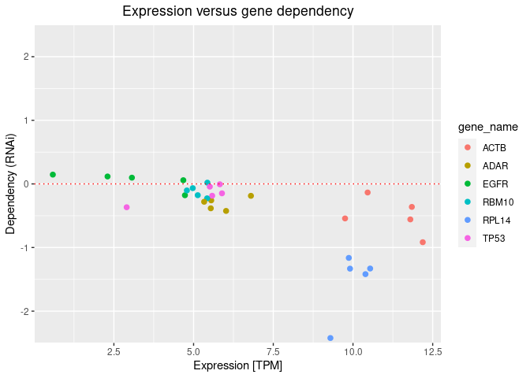
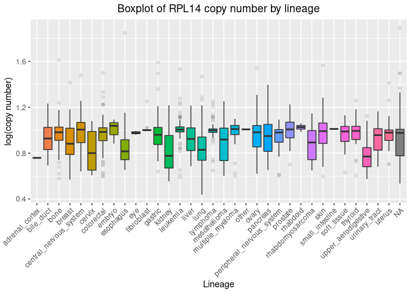

Exercise 9
================
Feras Machour
12/30/2021

[GitHub](https://github.com/ferasmachour/Genomic_Data_Science_Course.git)

Loading ExperimentHub package and DepMap data

### Home work

1.  Make a scatter plot of RPL14 expression vs rnai gene dependency for
    Rhabdomyosarcoma Sarcoma.

*I added a few more genes to make it more interesting*

``` r
cell_lines <- metadata %>% dplyr::filter(stringr::str_detect(lineage, "rhabdomyosarcoma"))
nrow(cell_lines) 
```

    ## [1] 19

**There are 19 cell lines from rhabdomyosarcoma lineage**

``` r
cell_lines_rnai <- rnai %>% dplyr::inner_join(metadata,by = "depmap_id") %>% dplyr::select(depmap_id, lineage) %>% dplyr::filter((stringr::str_detect(lineage,"rhabdomyosarcoma")))
nrow(unique(cell_lines_rnai[,1]))
```

    ## [1] 7

**We can see that only 7 out of 19 cell lines have RNAi dependency
data**

``` r
cell_lines_TPM <- TPM %>% dplyr::inner_join(metadata,by = "depmap_id") %>% dplyr::select(depmap_id, lineage) %>% dplyr::filter((stringr::str_detect(lineage,"rhabdomyosarcoma")))
nrow(unique(cell_lines_TPM[,1])) 
```

    ## [1] 17

**Also, 17 out of 19 cell lines have RNAi dependency data**

``` r
rnai_cells <- unique(cell_lines_rnai[,1])

tpm_cells <- unique(cell_lines_TPM[,1])

rnai_tpm_cells <- inner_join(rnai_cells,tpm_cells)
```

    ## Joining, by = "depmap_id"

``` r
nrow(rnai_tpm_cells) # Altogether, only 5 cell lines have data both for expression and RNAi
```

    ## [1] 5

``` r
TPM_genes <- TPM %>% dplyr::filter(gene_name %in% c("RPL14","RBM10","ADAR","TP53","EGFR","ACTB"))

exp_rnai_genes <- metadata %>% dplyr::select(depmap_id, lineage) %>%
          dplyr::filter(stringr::str_detect(lineage, "rhabdomyosarcoma")) %>%
          dplyr::inner_join(rnai, by = "depmap_id") %>% dplyr::filter(gene_name %in% c("RPL14","RBM10","ADAR","TP53","EGFR","ACTB")) %>% dplyr::inner_join(TPM_genes, by = "depmap_id") %>% dplyr::filter(gene_name.x == gene_name.y) %>% dplyr::rename(gene_name = gene_name.x) %>% ggplot(aes(x = expression, y = dependency, colour=gene_name)) + geom_point(size = 2) + scale_y_continuous(expand = c(0, 0), limits = c(-2.5, 2.5)) + geom_hline(yintercept=0,size=0.5,color="red",linetype="dotted") + ggtitle("Expression versus gene dependency") + xlab("Expression [TPM]") + ylab("Dependency (RNAi)") + theme(plot.title = element_text(hjust = 0.5))

exp_rnai_genes
```

<!-- -->

***We can see from the few chosen genes that there is a tendency that
the genes with higher expression are also more essential for these
cells.***

2.  Make a boxplot displaying log genomic copy number for gene RPL14 by
    lineage

``` r
metadata %>%
        dplyr::select(depmap_id, lineage) %>%
        dplyr::full_join(copyNumber, by = "depmap_id") %>%
        dplyr::filter(gene_name == "RPL14") %>%
        ggplot(aes(x = lineage, y = log_copy_number, fill = lineage)) +
        geom_boxplot(outlier.alpha = 0.1) +
        ggtitle("Boxplot of RPL14 copy number by lineage") +
        theme(axis.text.x = element_text(angle = 45, hjust=1)) +
        theme(legend.position = "none") + xlab("Lineage") + 
        ylab("log(copy number)") + theme(plot.title = element_text(hjust = 0.5))
```

    ## Warning: Removed 1 rows containing non-finite values (stat_boxplot).

<!-- -->

[link to github
repository](https://github.com/ferasmachour/Genomic_Data_Science_Course.git)
