Tutorial 2
================
Feras Machour
11/4/2021

[GitHub](https://github.com/ferasmachour/Genomic_Data_Science_Course.git)

###### Import counts data and design

``` r
library(compGenomRData)

counts_file <- system.file("extdata/rna-seq/SRP029880.raw_counts.tsv",
package = "compGenomRData") 
coldata_file <- system.file("extdata/rna-seq/SRP029880.colData.tsv",
package = "compGenomRData") # get the filepath

countdata = read.table(counts_file,header=TRUE, sep = '\t') # import data into R
countdata_mat = as.matrix(countdata) # convert dataframe to matrix
head(countdata_mat)
```

    ##          CASE_1 CASE_2 CASE_3 CASE_4 CASE_5 CTRL_1 CTRL_2 CTRL_3 CTRL_4 CTRL_5
    ## TSPAN6   776426 371725 612244 456147 513335 559544 489653 332084 238516 634115
    ## TNMD       1483    806   2995    297   1095   4631   1884   4484   1961   3976
    ## DPM1     364919 274342 248740 371045 325628 211173 123204 113606  67338 198331
    ## SCYL3    103601  97625  98387 117366 101943 160847 106890 106938  64928 101515
    ## C1ORF112  90805  59235  61460 108892  44839  52308  34236  38087  18522  58008
    ## FGR       57081 145623  26800 168519 158882  59723  24483  21608  18654  23682
    ##           width
    ## TSPAN6    12883
    ## TNMD      15084
    ## DPM1      23689
    ## SCYL3     44637
    ## C1ORF112 192074
    ## FGR       23214

``` r
coldata = read.table(coldata_file,header=TRUE,sep='\t')
head(coldata)
```

    ##                source_name group
    ## CASE_1 metastasized cancer  CASE
    ## CASE_2 metastasized cancer  CASE
    ## CASE_3 metastasized cancer  CASE
    ## CASE_4 metastasized cancer  CASE
    ## CASE_5 metastasized cancer  CASE
    ## CTRL_1        normal colon  CTRL

#### 1. Normalize the counts using the TPM approach

``` r
geneLengths = as.vector(countdata_mat[,"width"])

readcounts = subset(countdata_mat, select = c(-width))

RPK = apply(readcounts, 2 , function(x){x/(geneLengths/1000)}) # Calculate RPK

per_million = colSums(RPK)/10^6 # Calculate per million scaling factor

TPM = mapply('/', data.frame(RPK) ,per_million) 
row.names(TPM) <- row.names(RPK) # Calculate TPM

head(TPM)
```

    ##              CASE_1      CASE_2     CASE_3      CASE_4      CASE_5     CTRL_1
    ## TSPAN6   65.2454175 34.94535342 56.6343869 28.46238940 33.77412727 30.9262602
    ## TNMD      0.1064367  0.06471474  0.2366208  0.01582791  0.06153155  0.2186092
    ## DPM1     16.6769528 14.02588411 12.5132919 12.59109195 11.65132402  6.3474872
    ## SCYL3     2.5126726  2.64880948  2.6267297  2.11363915  1.93580977  2.5658315
    ## C1ORF112  0.5118093  0.37350334  0.3813262  0.45573348  0.19787349  0.1939142
    ## FGR       2.6620030  7.59739431  1.3758069  5.83555858  5.80129545  1.8319002
    ##               CTRL_2     CTRL_3      CTRL_4     CTRL_5
    ## TSPAN6   23.36534574 20.4865448 17.59616734 35.9038047
    ## TNMD      0.07678302  0.2362582  0.12356021  0.1922734
    ## DPM1      3.19726681  3.8114683  2.70166227  6.1070760
    ## SCYL3     1.47211886  1.9040346  1.38246645  1.6589171
    ## C1ORF112  0.10957595  0.1575963  0.09165093  0.2202971
    ## FGR       0.64835886  0.7397796  0.76372950  0.7441455

``` r
colSums(TPM) # Check whether columns are correctly normalized
```

    ## CASE_1 CASE_2 CASE_3 CASE_4 CASE_5 CTRL_1 CTRL_2 CTRL_3 CTRL_4 CTRL_5 
    ##  1e+06  1e+06  1e+06  1e+06  1e+06  1e+06  1e+06  1e+06  1e+06  1e+06

#### 2. Plot a heatmap of the top 500 most variable genes. Compare with the heatmap obtained using the top 100 most variable genes.

``` r
variance = apply(TPM , 1 , var)
variance = variance[order(variance, decreasing = 1)] # sort variance
Top500 <- names(variance[1:500])
Top100 <- names(variance[1:100])
library(pheatmap)
library(gridExtra)

pheatmap(TPM[Top500,] , show_rownames = FALSE , scale = "row", main = "Top 500" , annotation_col = coldata)
```

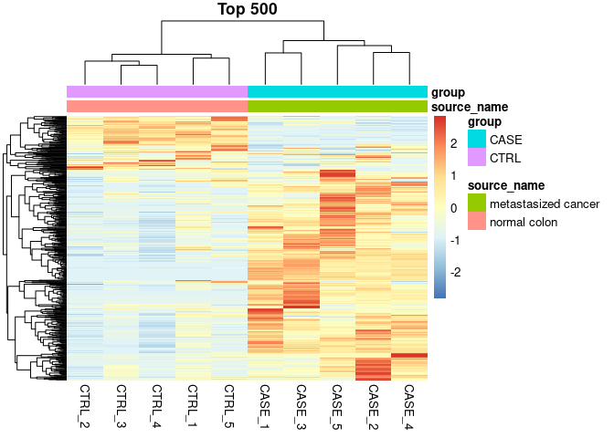<!-- -->

``` r
pheatmap(TPM[Top100,] , show_rownames = FALSE , scale = "row", main = "Top 100" , annotation_col = coldata)
```

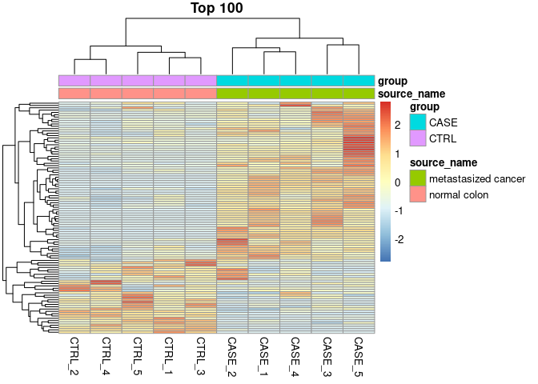<!-- -->

#### 3. Re-do the heatmaps setting the scale argument to none, and column. Compare the results with scale = ‘row’.

``` r
pheatmap(TPM[Top500,] , show_rownames = FALSE , scale = "row", main = "Top 500 - scale by rows" , annotation_col = coldata["group"])
```

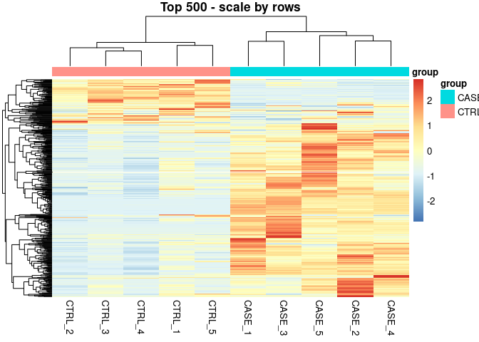<!-- -->

``` r
pheatmap(TPM[Top500,] , show_rownames = FALSE , scale = "column", main = "Top 500 - scale by columns" , annotation_col = coldata["group"])
```

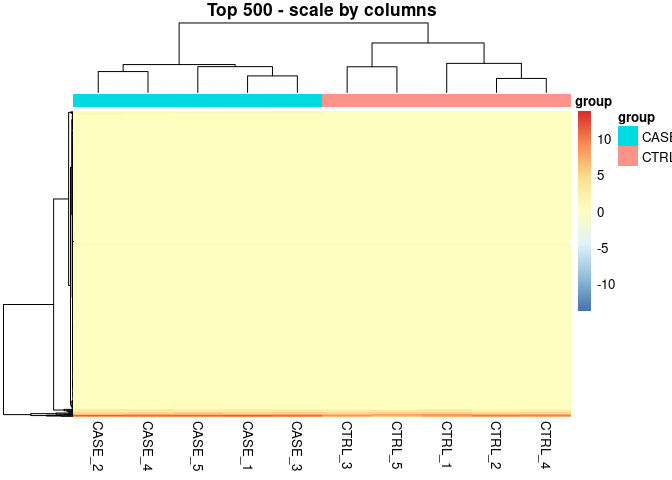<!-- -->

``` r
pheatmap(TPM[Top500,] , show_rownames = FALSE , scale = "none", main = "Top 500 - no scaling" , annotation_col = coldata["group"])
```

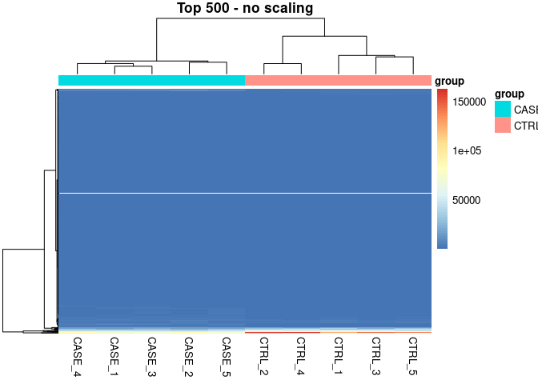<!-- -->

#### 4. Draw a correlation plot for the samples depicting the sample differences as ‘ellipses’, drawing only the upper end of the matrix, and order samples by hierarchical clustering results based on average linkage clustering method.

``` r
library(stats)
library(corrplot)
```

    ## corrplot 0.90 loaded

``` r
correlationMatrix <- cor(TPM)
head(correlationMatrix)
```

    ##           CASE_1    CASE_2    CASE_3    CASE_4    CASE_5    CTRL_1    CTRL_2
    ## CASE_1 1.0000000 0.9924606 0.9959093 0.9934098 0.9901892 0.9594011 0.9635760
    ## CASE_2 0.9924606 1.0000000 0.9887290 0.9935931 0.9898379 0.9725646 0.9793835
    ## CASE_3 0.9959093 0.9887290 1.0000000 0.9950905 0.9928878 0.9648812 0.9617747
    ## CASE_4 0.9934098 0.9935931 0.9950905 1.0000000 0.9922521 0.9739553 0.9748582
    ## CASE_5 0.9901892 0.9898379 0.9928878 0.9922521 1.0000000 0.9631663 0.9660868
    ## CTRL_1 0.9594011 0.9725646 0.9648812 0.9739553 0.9631663 1.0000000 0.9879862
    ##           CTRL_3    CTRL_4    CTRL_5
    ## CASE_1 0.9549607 0.9548669 0.9302553
    ## CASE_2 0.9674813 0.9739136 0.9448425
    ## CASE_3 0.9555745 0.9551676 0.9401090
    ## CASE_4 0.9643073 0.9709639 0.9510741
    ## CASE_5 0.9502160 0.9587173 0.9313136
    ## CTRL_1 0.9902278 0.9874452 0.9864399

``` r
corrplot(correlationMatrix, method = "ellipse" , hclust.method = "average" , order = "hclust", addrect = 2, addCoef.col = 'green', number.cex = 0.8,tl.cex = 0.5, tl.col = "black", type = "upper")
```

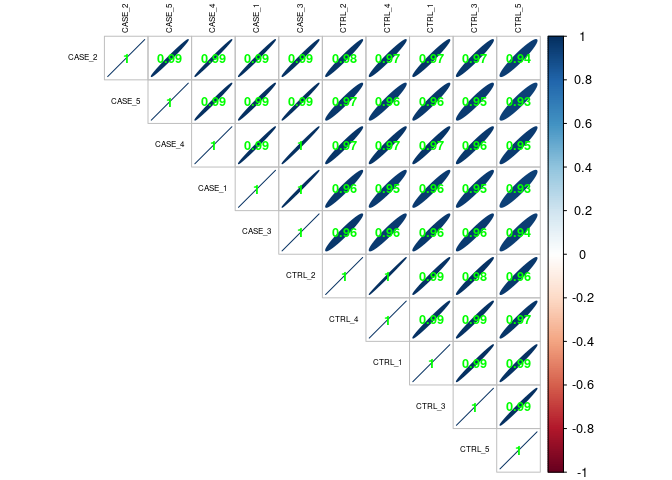<!-- -->

``` r
pheatmap(correlationMatrix, annotation_col = coldata , cutree_cols = 2)
```

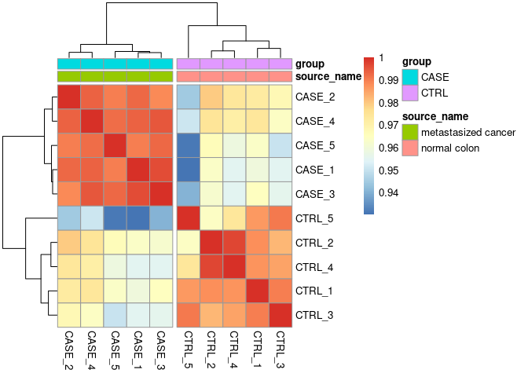<!-- -->

#### 5. How else could the count matrix be subsetted to obtain quick and accurate clusters? Try selecting the top 100 genes that have the highest total expression in all samples and re-draw the cluster heatmaps and PCA plots.

``` r
library(ggplot2)
library(stats)
library(pheatmap)
library(ggfortify)
library(corrplot)

gene_average_exp = apply(TPM , 1 , mean)
gene_average_exp = gene_average_exp[order(gene_average_exp,decreasing=1)]

High_exp = names(gene_average_exp[1:100])

pheatmap(TPM[High_exp,] , show_rownames = FALSE , scale = "row", main = "100 highest expression genes" , annotation_col = coldata["group"])
```

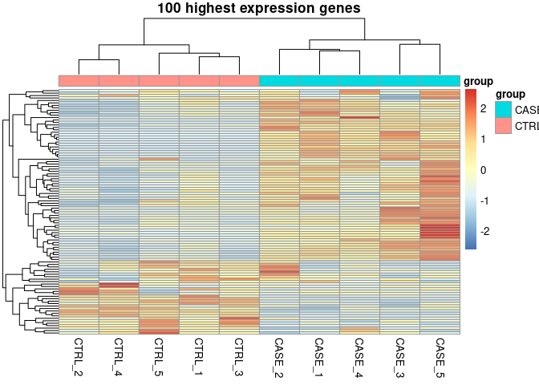<!-- -->

``` r
# Transform data for PCA
transpose_TPM = t(TPM[High_exp,])
transpose_TPM = log2(transpose_TPM + 1) 
pcaResults = prcomp(transpose_TPM)

autoplot(pcaResults, data = coldata, colour = 'group', main = "PCA - highest expression genes")
```

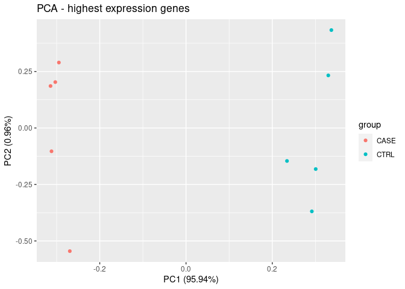<!-- -->

``` r
# CorrelationMatrix for the highest 100 genes

correlationMatrix_High <- cor(TPM[High_exp,])

pheatmap(correlationMatrix_High, annotation_col = coldata , cutree_cols = 2)
```

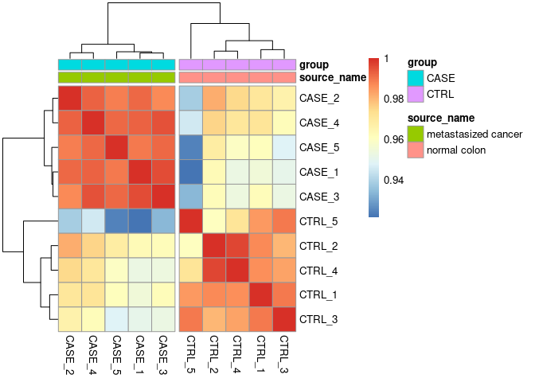<!-- -->

``` r
corrplot(correlationMatrix_High, method = "ellipse" , hclust.method = "average" , order = "hclust", addrect = 2, addCoef.col = 'green', number.cex = 0.8,tl.cex = 0.5, tl.col = "black", type = "upper", add = FALSE)
```

<!-- -->

#### 6. Add an additional column to the annotation data.frame object to annotate the samples and use the updated annotation data.frame to plot the heatmaps

``` r
# assign batches based on correlation data
batch = c("1","3","1","3","2","1","3","1","3","2")
coldata = cbind(coldata,batch)
pheatmap(correlationMatrix, annotation_col = coldata , cutree_cols = 2)
```

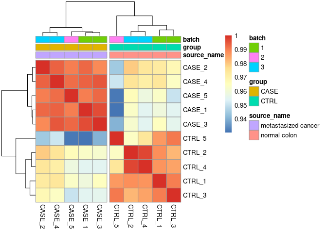<!-- -->

``` r
transpose_TPM = t(TPM)
transpose_TPM = log2(transpose_TPM + 1) 
pcaResults = prcomp(transpose_TPM)
autoplot(pcaResults, data = coldata, colour = 'batch', shape = 'group' , main = "PCA")
```

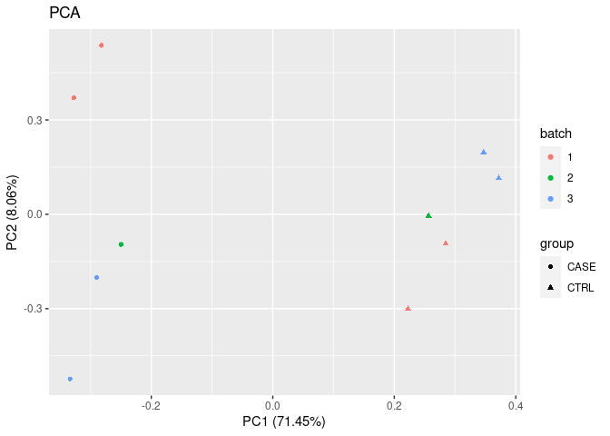<!-- -->

#### 7. Try making the heatmaps using all the genes in the count table, rather than sub-selecting.

``` r
library(tidyr)

# pheatmap(TPM , show_rownames = FALSE , main = "Heatmap of all the genes" , annotation_col = coldata , scale = "row") # doesn't work


is.na(TPM) %>% table() 
```

    ## .
    ##  FALSE 
    ## 197190

``` r
dim(TPM)
```

    ## [1] 19719    10

``` r
# no missing values

length(variance[variance==0])
```

    ## [1] 620

``` r
# list contains genes with 0 variance - probably those with 0 reads across all samples
# remove genes with 0 reads across all samples
TPM_clean = TPM[rowSums(TPM)!=0,]
pheatmap(TPM_clean , show_rownames = FALSE , main = "Heatmap of all the genes" , annotation_col = coldata , scale = "row")
```

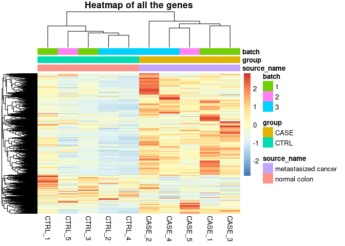<!-- -->

[link to github
repository](https://github.com/ferasmachour/Genomic_Data_Science_Course.git)
