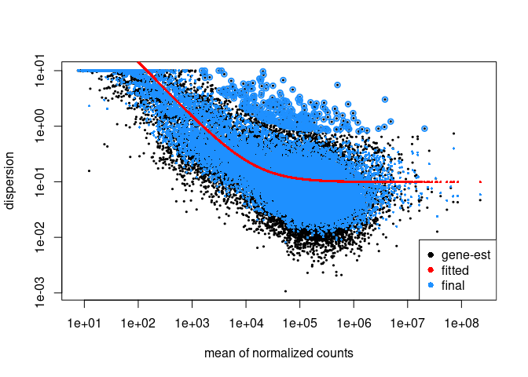
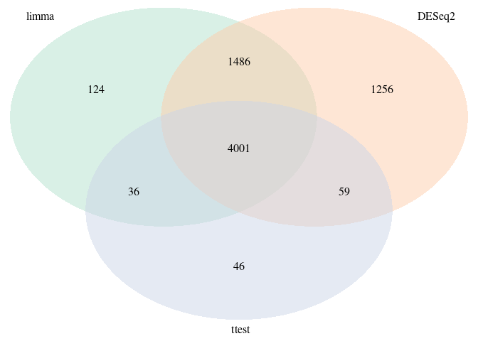

Tutorial 3
================
Feras Machour
11/12/2021

[GitHub](https://github.com/ferasmachour/Genomic_Data_Science_Course.git)

##### Import libraries and dataset

##### 1. Perform differential expression analysis using DESeq2

``` r
counts <- read.table(counts_file, header = T, sep = '\t')
#remove the 'width' column
countData <- as.matrix(subset(counts, select = c(-width)))

colData <- read.table(coldata_file, header = T, sep = '\t',
                      stringsAsFactors = TRUE) 


#create a DESeq dataset object from the count matrix and the colData
dds <- DESeqDataSetFromMatrix(countData = countData,
                              colData = colData,
                              design = ~ group)
```

    ## converting counts to integer mode

``` r
#print dds object to see the contents
print(dds)
```

    ## class: DESeqDataSet 
    ## dim: 19719 10 
    ## metadata(1): version
    ## assays(1): counts
    ## rownames(19719): TSPAN6 TNMD ... MYOCOS HSFX3
    ## rowData names(0):
    ## colnames(10): CASE_1 CASE_2 ... CTRL_4 CTRL_5
    ## colData names(2): source_name group

``` r
nrow(dds)
```

    ## [1] 19719

``` r
#Filter out genes with low counts.
filteration <- rowSums(DESeq2::counts(dds)) >= 100

dds <- dds[filteration, ]
nrow(dds)
```

    ## [1] 18831

``` r
dds <- DESeq(dds)
```

    ## estimating size factors

    ## estimating dispersions

    ## gene-wise dispersion estimates

    ## mean-dispersion relationship

    ## final dispersion estimates

    ## fitting model and testing

``` r
#Run DESeq2 contrasting the CASE sample with CONTROL samples
DEresults = results(dds, contrast = c("group", 'CASE', 'CTRL'))
DEresultsDf <-as.data.frame(DEresults)


ggplot()+
  geom_point(data = DEresultsDf, 
             mapping = aes(x = log2FoldChange, y = -log10(pvalue)), 
             col = "grey80", size =1) +
  
  geom_point(data = subset(DEresultsDf, log2FoldChange > 1 & pvalue < 0.05), 
             aes(log2FoldChange, -log10(pvalue)), color = "red", size =1)+
  geom_point(data = subset(DEresultsDf, log2FoldChange < -1 & pvalue < 0.05), 
            aes(log2FoldChange, -log10(pvalue)), color = "steelblue2", size =1)+
  theme_bw()+
  theme(legend.title =element_blank())+
  labs(x = "log2 (Fold change of case vs. control)", y= "-log10(P-value)")
```

    ## Warning: Removed 448 rows containing missing values (geom_point).

<!-- -->

``` r
# The up-regulated genes in case samples are in red
#The down-regulated genes in control samples are in blue
```

##### 2. Use DESeq2::plotDispEsts to make a dispersion plot

``` r
plotDispEsts(dds)
```

<!-- -->

##### 3. lfcThreshold arguement

``` r
# The default value of lfcThreshold is 0

# lfcThreshold specifies the log2(foldchange) value of the null hypothesis


# changing it to 1 would test the statistical significance of the foldchange being different than 1 rather than 0


sig <- subset(DEresultsDf, padj < 0.05)
# number of significant DE genes with lfcThreshold = 0 (default)

nrow(sig) 
```

    ## [1] 6936

``` r
DEresults_lfcThreshold = results(dds, contrast = c("group", 'CASE', 'CTRL'), lfcThreshold = 1)

DEresults_lfcThresholdDf <-as.data.frame(DEresults_lfcThreshold)
sig_lfcThresholdDf <- subset(DEresults_lfcThresholdDf, padj < 0.05)
# number of significant DE genes with lfcThreshold = 1
nrow(sig_lfcThresholdDf)
```

    ## [1] 1513

##### 4. Independent filtering

###### without independent filtering, many discoveries will be lost due to multiple testings

##### 5. Re-do the differential expression analysis using the edgeR package

``` r
library(statmod)
group=factor(c("CASE", "CASE", "CASE", "CASE", "CASE", "CONTROL","CONTROL","CONTROL","CONTROL","CONTROL"))
DGEList <- DGEList(counts=as.matrix(countData), group=group)
print(DGEList$samples)
```

    ##          group   lib.size norm.factors
    ## CASE_1    CASE 5835484126            1
    ## CASE_2    CASE 5385234092            1
    ## CASE_3    CASE 5186983103            1
    ## CASE_4    CASE 7188715474            1
    ## CASE_5    CASE 6828934042            1
    ## CTRL_1 CONTROL 6686566581            1
    ## CTRL_2 CONTROL 5390529841            1
    ## CTRL_3 CONTROL 5211852556            1
    ## CTRL_4 CONTROL 3607313731            1
    ## CTRL_5 CONTROL 5440016265            1

``` r
# filtering and normalization
dim(DGEList$counts)
```

    ## [1] 19719    10

``` r
cpm <- cpm(DGEList)
head(cpm)
```

    ##               CASE_1     CASE_2      CASE_3      CASE_4     CASE_5     CTRL_1
    ## TSPAN6   133.0525426 69.0267115 118.0347011 63.45319990 75.1705899 83.6818109
    ## TNMD       0.2541349  0.1496685   0.5774069  0.04131475  0.1603471  0.6925826
    ## DPM1      62.5344859 50.9433750  47.9546579 51.61492360 47.6835767 31.5816791
    ## SCYL3     17.7536255 18.1282742  18.9680587 16.32642166 14.9280985 24.0552454
    ## C1ORF112  15.5608340 10.9995218  11.8488915 15.14762970  6.5660321  7.8228489
    ## FGR        9.7817077 27.0411643   5.1667799 23.44215745 23.2660030  8.9317887
    ##              CTRL_2     CTRL_3     CTRL_4      CTRL_5
    ## TSPAN6   90.8357832 63.7170750 66.1201154 116.5649088
    ## TNMD      0.3495018  0.8603467  0.5436178   0.7308802
    ## DPM1     22.8556382 21.7976235 18.6670761  36.4577954
    ## SCYL3    19.8292196 20.5182320 17.9989890  18.6607898
    ## C1ORF112  6.3511382  7.3077662  5.1345687  10.6632034
    ## FGR       4.5418541  4.1459346  5.1711610   4.3532958

``` r
apply(DGEList$counts, 2, sum)
```

    ##     CASE_1     CASE_2     CASE_3     CASE_4     CASE_5     CTRL_1     CTRL_2 
    ## 5835484126 5385234092 5186983103 7188715474 6828934042 6686566581 5390529841 
    ##     CTRL_3     CTRL_4     CTRL_5 
    ## 5211852556 3607313731 5440016265

``` r
# since the libraries have a large number of reads, we chose a small cpm threshold that matches the number of filtered genes from the DESeq2 count data 
# alternatively, this filtering could be done similar to the way it was done for DESeq2 (wanted to try the cpm approach)

keep <- rowSums(cpm(DGEList)>0.01) >= 5
DGEList <- DGEList[keep,]
dim(DGEList$counts)
```

    ## [1] 17907    10

``` r
# Recompute the library sizes
DGEList$samples$lib.size <- colSums(DGEList$counts)
print(DGEList$samples)
```

    ##          group   lib.size norm.factors
    ## CASE_1    CASE 5835374756            1
    ## CASE_2    CASE 5385160474            1
    ## CASE_3    CASE 5186922808            1
    ## CASE_4    CASE 7188598519            1
    ## CASE_5    CASE 6828845037            1
    ## CTRL_1 CONTROL 6686469277            1
    ## CTRL_2 CONTROL 5390463658            1
    ## CTRL_3 CONTROL 5211802406            1
    ## CTRL_4 CONTROL 3607278067            1
    ## CTRL_5 CONTROL 5439941878            1

``` r
# Compute normalization factor
DGEList <- calcNormFactors(DGEList)
print(DGEList$samples)
```

    ##          group   lib.size norm.factors
    ## CASE_1    CASE 5835374756    1.0374713
    ## CASE_2    CASE 5385160474    1.1516677
    ## CASE_3    CASE 5186922808    0.9661356
    ## CASE_4    CASE 7188598519    1.0261805
    ## CASE_5    CASE 6828845037    0.9487232
    ## CTRL_1 CONTROL 6686469277    1.0769873
    ## CTRL_2 CONTROL 5390463658    0.9777108
    ## CTRL_3 CONTROL 5211802406    0.9937108
    ## CTRL_4 CONTROL 3607278067    0.8930339
    ## CTRL_5 CONTROL 5439941878    0.9522400

``` r
plotMDS(DGEList, pch=20, col=as.numeric(DGEList$samples$group))
legend("bottomleft", as.character(unique(DGEList$samples$group)), col=1:3, pch=20)
```

<!-- -->

``` r
# compute dispersion

DGEList <- estimateDisp(DGEList,verbose=T)
```

    ## Using classic mode.

``` r
plotBCV(DGEList)
```

<!-- -->

``` r
# Differential expression analysis

fit <- glmFit(DGEList)

# number of significant DE genes with edgeR


DE <- exactTest(DGEList, pair=c(1,2))
topTags(DE)
```

    ## Comparison of groups:  CONTROL-CASE 
    ##             logFC    logCPM        PValue           FDR
    ## CYP2E1  -9.352540  9.753614 1.751365e-174 3.136170e-170
    ## FCGBP    7.581728 10.859185 7.879685e-159 7.055076e-155
    ## ASGR2   -8.010344  6.252676 3.988391e-156 2.380671e-152
    ## GCKR    -7.818108  4.161855 8.122825e-117 3.636386e-113
    ## APOA5  -10.194120  6.290034 3.629887e-114 1.300008e-110
    ## ZG16     6.982791  8.575280 8.814517e-114 2.630693e-110
    ## AADAC   -8.242485  5.901567 1.980562e-113 5.066561e-110
    ## A1BG    -7.759209  8.238824 4.333189e-112 9.699303e-109
    ## APCS    -9.641271  7.329677 1.504549e-108 2.993552e-105
    ## PRG4    -5.274218  4.893400 3.444931e-107 6.168838e-104

``` r
summary(decideTests(DE))
```

    ##        CONTROL-CASE
    ## Down           2967
    ## NotSig        12118
    ## Up             2822

``` r
DE <- topTags(DE, n = "Inf")

sig_edgeR <- subset(DE$table, FDR <= 0.05)
print(nrow(sig_edgeR))
```

    ## [1] 5789

``` r
# number of significant DE genes with DESeq2

sig_DESeq <- subset(DEresultsDf, padj <= 0.05)
print(nrow(sig_DESeq))
```

    ## [1] 6936

``` r
# similar number of DE genes

library(VennDiagram)
```

    ## Loading required package: grid

    ## Loading required package: futile.logger

``` r
venn <- venn.diagram(
  x = list(row.names(sig_edgeR), row.names(sig_DESeq)),
  category.names = c("edgeR" , "DESeq2 " ),
  filename = NULL,
  lwd = 2,
  lty = 'blank',
  fill = c("#440154ff" , '#21908dff')
  )
grid.newpage()
grid.draw(venn)
```

<!-- -->

##### 6. Use the compcodeR package to run the differential expression analysis using at least three different tools

``` r
info.parameters <- list(dataset = "countdata", uID = "123456")
colnames(colData)[2] <- "condition"

cpd <- compData(count.matrix = countData, 
                sample.annotations = colData, 
                info.parameters = info.parameters)
saveRDS(cpd, file = "cpd.rds")

check_compData(cpd)
```

    ## [1] TRUE

``` r
runDiffExp("cpd.rds", 
           result.extent = "voom.limma", Rmdfunction = "voom.limma.createRmd", 
           output.directory = ".", norm.method = "TMM")
```

    ## 
    ## 
    ## processing file: tempcode.Rmd

    ##   |                                                                              |                                                                      |   0%  |                                                                              |...................................                                   |  50%
    ##   ordinary text without R code
    ## 
    ##   |                                                                              |......................................................................| 100%
    ## label: unnamed-chunk-1 (with options) 
    ## List of 6
    ##  $ echo   : logi TRUE
    ##  $ eval   : logi TRUE
    ##  $ include: logi TRUE
    ##  $ message: logi FALSE
    ##  $ error  : logi TRUE
    ##  $ warning: logi TRUE

    ## output file: tempcode.md

    ## [1] TRUE

``` r
runDiffExp("cpd.rds", 
           result.extent = "DESeq2", Rmdfunction = "DESeq2.createRmd", 
           output.directory = ".", fit.type = "parametric",test = "Wald")
```

    ## 
    ## 
    ## processing file: tempcode.Rmd

    ##   |                                                                              |                                                                      |   0%  |                                                                              |...................................                                   |  50%
    ##   ordinary text without R code
    ## 
    ##   |                                                                              |......................................................................| 100%
    ## label: unnamed-chunk-1 (with options) 
    ## List of 6
    ##  $ echo   : logi TRUE
    ##  $ eval   : logi TRUE
    ##  $ include: logi TRUE
    ##  $ message: logi TRUE
    ##  $ error  : logi TRUE
    ##  $ warning: logi TRUE

    ## output file: tempcode.md

    ## [1] TRUE

``` r
runDiffExp("cpd.rds", 
           result.extent = "ttest", Rmdfunction = "ttest.createRmd", 
           output.directory = ".", norm.method = "TMM")
```

    ## 
    ## 
    ## processing file: tempcode.Rmd

    ##   |                                                                              |                                                                      |   0%  |                                                                              |...................................                                   |  50%
    ##   ordinary text without R code
    ## 
    ##   |                                                                              |......................................................................| 100%
    ## label: unnamed-chunk-1 (with options) 
    ## List of 6
    ##  $ echo   : logi TRUE
    ##  $ eval   : logi TRUE
    ##  $ include: logi TRUE
    ##  $ message: logi FALSE
    ##  $ error  : logi TRUE
    ##  $ warning: logi TRUE

    ## Loading required package: genefilter

    ## 
    ## Attaching package: 'genefilter'

    ## The following objects are masked from 'package:MatrixGenerics':
    ## 
    ##     rowSds, rowVars

    ## The following objects are masked from 'package:matrixStats':
    ## 
    ##     rowSds, rowVars

    ## output file: tempcode.md

    ## [1] TRUE

``` r
voom.limma = readRDS("cpd_voom.limma.rds")
DESeq2 = readRDS("cpd_DESeq2.rds")
ttest = readRDS("cpd_ttest.rds")

voom.limma <- as.data.frame(voom.limma@result.table)
sig_limma = subset(voom.limma, adjpvalue <= 0.05)
nrow(sig_limma)
```

    ## [1] 5647

``` r
DESeq2 <- as.data.frame(DESeq2@result.table)
sig_DESeq2 = subset(DESeq2, adjpvalue <= 0.05)
nrow(sig_DESeq2)
```

    ## [1] 6802

``` r
ttest <- as.data.frame(ttest@result.table)
sig_ttest = subset(ttest, adjpvalue <= 0.05)
nrow(sig_ttest)
```

    ## [1] 4142

``` r
library(RColorBrewer)
myCol <- brewer.pal(3, "Pastel2")
venn <- venn.diagram(
  x = list(row.names(sig_limma), row.names(sig_DESeq2), row.names(sig_ttest)),
  category.names = c("limma" , "DESeq2 " , " ttest"),
  filename = NULL,
  lwd = 2,
  lty = 'blank',
  fill = myCol
  )
grid.newpage()
grid.draw(venn)
```

<!-- --> [link to github
repository](https://github.com/ferasmachour/Genomic_Data_Science_Course.git)
