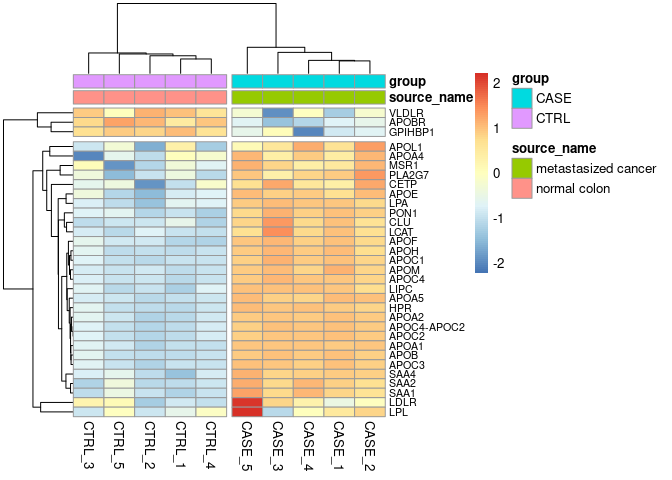

Tutorial 4
================
Feras Machour
11/18/2021

[GitHub](https://github.com/ferasmachour/Genomic_Data_Science_Course.git)

``` r
counts_file <- system.file("extdata/rna-seq/SRP029880.raw_counts.tsv",
package = "compGenomRData")
coldata_file <- system.file("extdata/rna-seq/SRP029880.colData.tsv",
package = "compGenomRData")
counts <- as.matrix(read.table(counts_file, header = T, sep = '\t'))
#remove the 'width' column
countData <- as.matrix(subset(counts, select = c(-width)))
#define the experimental setup
colData <- read.table(coldata_file, header = T, sep = '\t',
stringsAsFactors = TRUE)
#define the design formula
designFormula <- "~ group"
#create a DESeq dataset object from the count matrix and the colData
dds <- DESeqDataSetFromMatrix(countData = countData,
colData = colData,
design = as.formula(designFormula))
```

    ## converting counts to integer mode

``` r
dds <- DESeq(dds)
```

    ## estimating size factors

    ## estimating dispersions

    ## gene-wise dispersion estimates

    ## mean-dispersion relationship

    ## final dispersion estimates

    ## fitting model and testing

``` r
DEresults = results(dds, contrast = c("group", 'CASE', 'CTRL'))
```

``` r
#remove genes with NA values
DEresults_clean <- DEresults[!is.na(DEresults$padj),]

#select genes with adjusted p-values below 0.1
DE <- DEresults_clean[DEresults_clean$padj < 0.1,]
#select genes with absolute log2 fold change above 1 (two-fold change)
DE <- DE[abs(DE$log2FoldChange) > 1,]
#get the list of genes of interest
genesOfInterest <- rownames(DE)
```

##### gProfileR

1.  Re-run gProfileR, this time using pathway annotations such as KEGG,
    REACTOME, and protein complex databases such as CORUM, in addition
    to the GO terms. Sort the resulting tables by columns precision
    and/or recall. How do the top GO terms change when sorted for
    precision, recall, or p.value? hint: use order() for sorting

``` r
goResults <- gprofiler(query = genesOfInterest,
organism = 'hsapiens',
src_filter = 'GO',
hier_filtering = 'moderate')
```

    ## Warning: Please consider using the new package "gprofiler2". At the moment you are using a deprecated package relying on outdated data.
    ##   More information at https://biit.cs.ut.ee/gprofiler/page/r-new. Feel free to contact us at biit.support@ut.ee for further help.

``` r
head(goResults[,1:13])
```

    ##   query.number significant  p.value term.size query.size overlap.size precision
    ## 1            1        TRUE 5.51e-15      1399       4201          436     0.104
    ## 2            1        TRUE 1.12e-05       143       4201           62     0.015
    ## 3            1        TRUE 1.46e-03        20       4201           15     0.004
    ## 4            1        TRUE 9.50e-06       996       4201          291     0.069
    ## 5            1        TRUE 2.83e-05       317       4201          112     0.027
    ## 6            1        TRUE 1.60e-05       220       4201           85     0.020
    ##   recall    term.id domain subgraph.number
    ## 1  0.312 GO:0006629     BP              77
    ## 2  0.434 GO:0050880     BP              54
    ## 3  0.750 GO:0043691     BP              28
    ## 4  0.292 GO:0055114     BP              47
    ## 5  0.353 GO:0032496     BP              81
    ## 6  0.386 GO:0007187     BP              82
    ##                                                                                     term.name
    ## 1                                                                     lipid metabolic process
    ## 2                                                             regulation of blood vessel size
    ## 3                                                               reverse cholesterol transport
    ## 4                                                                 oxidation-reduction process
    ## 5                                                              response to lipopolysaccharide
    ## 6 G-protein coupled receptor signaling pathway, coupled to cyclic nucleotide second messenger
    ##   relative.depth
    ## 1              1
    ## 2              1
    ## 3              1
    ## 4              1
    ## 5              1
    ## 6              1

``` r
# order by precision: we get the most true positives from the selected elements first
head(goResults[order(goResults$precision,decreasing = TRUE),1:13])
```

    ##    query.number significant  p.value term.size query.size overlap.size
    ## 20            1        TRUE 1.11e-23      7414       4201         1899
    ## 31            1        TRUE 2.37e-19      4760       4201         1271
    ## 10            1        TRUE 1.07e-34      3656       4201         1085
    ## 55            1        TRUE 1.18e-12      3788       4201         1003
    ## 56            1        TRUE 8.54e-58      2740       4201          935
    ## 33            1        TRUE 2.88e-13      2121       4201          609
    ##    precision recall    term.id domain subgraph.number
    ## 20     0.452  0.256 GO:0032501     BP              48
    ## 31     0.303  0.267 GO:0048731     BP              84
    ## 10     0.258  0.297 GO:0065008     BP              55
    ## 55     0.239  0.265 GO:0031982     CC              24
    ## 56     0.223  0.341 GO:0044459     CC              53
    ## 33     0.145  0.287 GO:0008283     BP              41
    ##                           term.name relative.depth
    ## 20 multicellular organismal process              1
    ## 31               system development              1
    ## 10 regulation of biological quality              1
    ## 55                          vesicle              1
    ## 56             plasma membrane part              1
    ## 33               cell proliferation              1

``` r
# order by recall: we get the most true positives from the relevant elements first
head(goResults[order(goResults$recall,decreasing = TRUE),1:13])
```

    ##    query.number significant  p.value term.size query.size overlap.size
    ## 38            1        TRUE 2.91e-05        12       4201           12
    ## 46            1        TRUE 1.34e-06        14       4201           14
    ## 73            1        TRUE 5.56e-03        11       4201           10
    ## 24            1        TRUE 9.12e-09        27       4201           23
    ## 36            1        TRUE 9.12e-09        27       4201           23
    ## 22            1        TRUE 2.69e-02        12       4201           10
    ##    precision recall    term.id domain subgraph.number
    ## 38     0.003  1.000 GO:0001867     BP              27
    ## 46     0.003  1.000 GO:0006957     BP              74
    ## 73     0.002  0.909 GO:0004954     MF              30
    ## 24     0.005  0.852 GO:0034369     BP              10
    ## 36     0.005  0.852 GO:0034368     BP              22
    ## 22     0.002  0.833 GO:0034384     BP               2
    ##                                      term.name relative.depth
    ## 38       complement activation, lectin pathway              1
    ## 46  complement activation, alternative pathway              1
    ## 73                prostanoid receptor activity              1
    ## 24      plasma lipoprotein particle remodeling              1
    ## 36            protein-lipid complex remodeling              1
    ## 22 high-density lipoprotein particle clearance              1

``` r
# order by p.value: get the most significant first
head(goResults[order(goResults$p.value,decreasing = FALSE),1:13])
```

    ##    query.number significant  p.value term.size query.size overlap.size
    ## 56            1        TRUE 8.54e-58      2740       4201          935
    ## 39            1        TRUE 1.62e-37      1609       4201          570
    ## 10            1        TRUE 1.07e-34      3656       4201         1085
    ## 20            1        TRUE 1.11e-23      7414       4201         1899
    ## 23            1        TRUE 1.23e-23       385       4201          177
    ## 92            1        TRUE 1.30e-23      1069       4201          379
    ##    precision recall    term.id domain subgraph.number
    ## 56     0.223  0.341 GO:0044459     CC              53
    ## 39     0.136  0.354 GO:0006811     BP              35
    ## 10     0.258  0.297 GO:0065008     BP              55
    ## 20     0.452  0.256 GO:0032501     BP              48
    ## 23     0.042  0.460 GO:0043062     BP              87
    ## 92     0.090  0.355 GO:0022857     MF              17
    ##                               term.name relative.depth
    ## 56                 plasma membrane part              1
    ## 39                        ion transport              1
    ## 10     regulation of biological quality              1
    ## 20     multicellular organismal process              1
    ## 23 extracellular structure organization              1
    ## 92   transmembrane transporter activity              1

``` r
KEGGResults <- gprofiler(query = genesOfInterest,
organism = 'hsapiens',
src_filter = 'KEGG',
hier_filtering = 'moderate')
```

    ## Warning: Please consider using the new package "gprofiler2". At the moment you are using a deprecated package relying on outdated data.
    ##   More information at https://biit.cs.ut.ee/gprofiler/page/r-new. Feel free to contact us at biit.support@ut.ee for further help.

``` r
head(KEGGResults[order(KEGGResults$p.value,decreasing = FALSE),1:13])
```

    ##    query.number significant  p.value term.size query.size overlap.size
    ## 18            1        TRUE 1.84e-26        79       1769           66
    ## 1             1        TRUE 1.27e-10       278       1769          121
    ## 27            1        TRUE 4.30e-10        71       1769           45
    ## 12            1        TRUE 5.74e-08        52       1769           34
    ## 6             1        TRUE 8.54e-07        81       1769           44
    ## 5             1        TRUE 6.78e-06       292       1769          112
    ##    precision recall    term.id domain subgraph.number
    ## 18     0.037  0.835 KEGG:04610    keg              13
    ## 1      0.068  0.435 KEGG:04080    keg              16
    ## 27     0.025  0.634 KEGG:04976    keg               1
    ## 12     0.019  0.654 KEGG:05150    keg               6
    ## 6      0.025  0.543 KEGG:05204    keg              25
    ## 5      0.063  0.384 KEGG:04060    keg               3
    ##                                  term.name relative.depth
    ## 18     Complement and coagulation cascades              1
    ## 1  Neuroactive ligand-receptor interaction              1
    ## 27                          Bile secretion              1
    ## 12         Staphylococcus aureus infection              1
    ## 6                  Chemical carcinogenesis              1
    ## 5   Cytokine-cytokine receptor interaction              1

``` r
REACTOMEResults <- gprofiler(query = genesOfInterest,
organism = 'hsapiens',
src_filter = 'REAC',
hier_filtering = 'moderate')
```

    ## Warning: Please consider using the new package "gprofiler2". At the moment you are using a deprecated package relying on outdated data.
    ##   More information at https://biit.cs.ut.ee/gprofiler/page/r-new. Feel free to contact us at biit.support@ut.ee for further help.

``` r
head(REACTOMEResults[order(REACTOMEResults$p.value,decreasing = FALSE),1:13])
```

    ##    query.number significant  p.value term.size query.size overlap.size
    ## 11            1        TRUE 2.35e-14       296       2479          134
    ## 21            1        TRUE 7.09e-12       125       2479           69
    ## 13            1        TRUE 1.26e-10       222       2479          101
    ## 17            1        TRUE 2.74e-10       365       2479          146
    ## 8             1        TRUE 6.75e-10       716       2479          248
    ## 26            1        TRUE 1.04e-09       453       2479          171
    ##    precision recall            term.id domain subgraph.number
    ## 11     0.054  0.453 REAC:R-HSA-1474244    rea              11
    ## 21     0.028  0.552  REAC:R-HSA-381426    rea              14
    ## 13     0.041  0.455  REAC:R-HSA-211859    rea              20
    ## 17     0.059  0.400  REAC:R-HSA-112316    rea              23
    ## 8      0.100  0.346  REAC:R-HSA-382551    rea               9
    ## 26     0.069  0.377  REAC:R-HSA-500792    rea               3
    ##                                                                                                                      term.name
    ## 11                                                                                           Extracellular matrix organization
    ## 21 Regulation of Insulin-like Growth Factor (IGF) transport and uptake by Insulin-like Growth Factor Binding Proteins (IGFBPs)
    ## 13                                                                                                       Biological oxidations
    ## 17                                                                                                             Neuronal System
    ## 8                                                                                                 Transport of small molecules
    ## 26                                                                                                         GPCR ligand binding
    ##    relative.depth
    ## 11              1
    ## 21              1
    ## 13              1
    ## 17              1
    ## 8               1
    ## 26              1

``` r
CORUMResults <- gprofiler(query = genesOfInterest,
organism = 'hsapiens',
src_filter = 'CORUM',
hier_filtering = 'moderate')
```

    ## Warning: Please consider using the new package "gprofiler2". At the moment you are using a deprecated package relying on outdated data.
    ##   More information at https://biit.cs.ut.ee/gprofiler/page/r-new. Feel free to contact us at biit.support@ut.ee for further help.

``` r
# no significant enrichment found with the CORUM database
head(CORUMResults[order(CORUMResults$p.value,decreasing = FALSE),1:13])
```

    ##  [1] query.number    significant     p.value         term.size      
    ##  [5] query.size      overlap.size    precision       recall         
    ##  [9] term.id         domain          subgraph.number term.name      
    ## [13] relative.depth 
    ## <0 rows> (or 0-length row.names)

#### Gene set enrichment analysis

We use the bioconductor package gage to demonstrate how to do GSEA using
normalized expression data of the samples as input.

``` r
#Let's define the first gene set as the list of genes from one of the
#significant GO terms found in the GO analysis. order go results by pvalue
goResults <- goResults[order(goResults$p.value),]

#restrict the terms that have at most 100 genes overlapping with the query
go <- goResults[goResults$overlap.size < 100,]

# use the top term from this table to create a gene set
geneSet1 <- unlist(strsplit(go[1,]$intersection, ','))


#table get normalized counts from DESeq2 results
normalizedCounts <- DESeq2::counts(dds, normalized = TRUE)

#Define another gene set by just randomly selecting 25 genes from the counts
geneSet2 <- sample(rownames(normalizedCounts), 25)

# geneSets list

geneSets <- list('top_GO_term' = geneSet1,
                 'random_set' = geneSet2)

# Using the defined gene sets, we’d like to do a group comparison between the case
# samples with respect to the control samples.

#Use the normalized counts to carry out a GSEA.
gseaResults <- gage(exprs = log2(normalizedCounts+1),
                    ref = match(rownames(colData[colData$group =='CTRL',]),
                                colnames(normalizedCounts)),
                    samp = match(rownames(colData[colData$group == 'CASE',]),
                                 colnames(normalizedCounts)),
                    gsets = geneSets, compare = 'as.group')
# Up-regulation statistics
gseaResults$greater 
```

    ##                p.geomean stat.mean        p.val        q.val set.size
    ## top_GO_term 2.528068e-09  7.223502 2.528068e-09 5.056136e-09       32
    ## random_set  2.879263e-01  0.563505 2.879263e-01 2.879263e-01       25
    ##                     exp1
    ## top_GO_term 2.528068e-09
    ## random_set  2.879263e-01

``` r
# Down-regulation statistics
gseaResults$less
```

    ##             p.geomean stat.mean     p.val q.val set.size      exp1
    ## random_set  0.7120737  0.563505 0.7120737     1       25 0.7120737
    ## top_GO_term 1.0000000  7.223502 1.0000000     1       32 1.0000000

``` r
# There is significant up-regulation of the most enriched GOTerm in the CASE vs CONTROL


# Visualize the expression of these genes by heatmap
# get the expression data for the gene set of interest
M <- normalizedCounts[rownames(normalizedCounts) %in% geneSet1, ]
# log transform the counts for visualization scaling by row helps visualizing
# relative change of expression of a gene in multiple conditions
pheatmap(log2(M+1),
annotation_col = colData,
show_rownames = TRUE,
fontsize_row = 8,
scale = 'row',
cutree_cols = 2,
cutree_rows = 2)
```

<!-- -->

``` r
# Looking at the heatmap we can see that most genes in the most enriched GOterm are indeed upregulated 
```

2.  Repeat the gene set enrichment analysis by trying different options
    for the `compare` argument of the `GAGE:gage` function. How do the
    results differ? \[Difficulty: **Beginner**\]

``` r
# compare = 'paired' - every case sample is paired with a control sample - one p-value for each pair comparison
gseaResults.paired <- gage(exprs = log2(normalizedCounts+1),
                    ref = match(rownames(colData[colData$group =='CTRL',]),
                                colnames(normalizedCounts)),
                    samp = match(rownames(colData[colData$group == 'CASE',]),
                                 colnames(normalizedCounts)),
                    gsets = geneSets, compare = 'paired')
gseaResults.paired
```

    ## $greater
    ##                p.geomean stat.mean        p.val        q.val set.size
    ## top_GO_term 9.613676e-09 6.6491250 2.034802e-36 4.069605e-36       32
    ## random_set  2.678678e-01 0.4700195 1.502318e-01 1.502318e-01       25
    ##                   CASE_1       CASE_2       CASE_3       CASE_4       CASE_5
    ## top_GO_term 3.537417e-08 1.591399e-09 3.172477e-08 4.891313e-08 9.400654e-10
    ## random_set  6.061042e-01 1.434817e-01 2.776869e-01 6.704155e-01 8.518429e-02
    ## 
    ## $less
    ##             p.geomean stat.mean     p.val q.val set.size    CASE_1    CASE_2
    ## random_set  0.5932377 0.4700195 0.8497682     1       25 0.3938958 0.8565183
    ## top_GO_term 1.0000000 6.6491250 1.0000000     1       32 1.0000000 1.0000000
    ##                CASE_3    CASE_4    CASE_5
    ## random_set  0.7223131 0.3295845 0.9148157
    ## top_GO_term 1.0000000 1.0000000 1.0000000
    ## 
    ## $stats
    ##             stat.mean     CASE_1   CASE_2    CASE_3     CASE_4   CASE_5
    ## top_GO_term 6.6491250  6.3445922 7.138365 6.3130458  6.1748746 7.274747
    ## random_set  0.4700195 -0.2708098 1.076780 0.5940682 -0.4440265 1.394085

``` r
# compare = 'unpaired' - one-on-one comparison between all possible CONTROL and CASE combinations
gseaResults.unpaired <- gage(exprs = log2(normalizedCounts+1),
                    ref = match(rownames(colData[colData$group =='CTRL',]),
                                colnames(normalizedCounts)),
                    samp = match(rownames(colData[colData$group == 'CASE',]),
                                 colnames(normalizedCounts)),
                    gsets = geneSets, compare = 'unpaired')
gseaResults.unpaired
```

    ## $greater
    ##                p.geomean stat.mean        p.val        q.val set.size
    ## top_GO_term 1.148544e-08 6.6083638 4.515501e-36 9.031003e-36       32
    ## random_set  2.848150e-01 0.4743911 1.472612e-01 1.472612e-01       25
    ##                   CASE_1       CASE_2       CASE_3       CASE_4       CASE_5
    ## top_GO_term 2.514557e-08 6.294789e-09 2.157509e-08 2.383455e-08 2.642881e-09
    ## random_set  4.422840e-01 1.766338e-01 2.504878e-01 5.630631e-01 2.247357e-01
    ## 
    ## $less
    ##             p.geomean stat.mean     p.val q.val set.size   CASE_1    CASE_2
    ## random_set  0.6266849 0.4743911 0.8527388     1       25 0.557716 0.8233662
    ## top_GO_term 1.0000000 6.6083638 1.0000000     1       32 1.000000 1.0000000
    ##                CASE_3    CASE_4    CASE_5
    ## random_set  0.7495122 0.4369369 0.7752643
    ## top_GO_term 1.0000000 1.0000000 1.0000000
    ## 
    ## $stats
    ##             stat.mean    CASE_1    CASE_2    CASE_3     CASE_4    CASE_5
    ## top_GO_term 6.6083638 6.4006248 6.7491251 6.4433925  6.4294624 7.0192142
    ## random_set  0.4743911 0.1467605 0.9396714 0.6804262 -0.1598235 0.7649209

``` r
# compare = '1ongroup', comparison between one CASE column at a time vs the average of all CONTROL columns.

gseaResults.1ongroup <- gage(exprs = log2(normalizedCounts+1),
                    ref = match(rownames(colData[colData$group =='CTRL',]),
                                colnames(normalizedCounts)),
                    samp = match(rownames(colData[colData$group == 'CASE',]),
                                 colnames(normalizedCounts)),
                    gsets = geneSets, compare = '1ongroup')
gseaResults.1ongroup
```

    ## $greater
    ##                p.geomean stat.mean        p.val        q.val set.size
    ## top_GO_term 4.432085e-09 6.9310827 4.032550e-38 8.065101e-38       32
    ## random_set  2.904669e-01 0.4904862 1.387438e-01 1.387438e-01       25
    ##                   CASE_1       CASE_2       CASE_3       CASE_4       CASE_5
    ## top_GO_term 1.029666e-08 2.020135e-09 9.071084e-09 9.526645e-09 9.514028e-10
    ## random_set  4.553050e-01 1.499549e-01 2.459163e-01 5.834111e-01 2.110853e-01
    ## 
    ## $less
    ##             p.geomean stat.mean     p.val q.val set.size   CASE_1    CASE_2
    ## random_set  0.6485606 0.4904862 0.8612562     1       25 0.544695 0.8500451
    ## top_GO_term 1.0000000 6.9310827 1.0000000     1       32 1.000000 1.0000000
    ##                CASE_3    CASE_4    CASE_5
    ## random_set  0.7540837 0.4165889 0.7889147
    ## top_GO_term 1.0000000 1.0000000 1.0000000
    ## 
    ## $stats
    ##             stat.mean    CASE_1   CASE_2    CASE_3     CASE_4    CASE_5
    ## top_GO_term 6.9310827 6.6962094 7.118016 6.7328078  6.7385108 7.3698694
    ## random_set  0.4904862 0.1128814 1.047960 0.6930798 -0.2118572 0.8103675

``` r
# we get sligthly different p-values for each compare method but the trend is the same
```

3.  Make a scatter plot of GO term sizes and obtained p-values by
    setting the `gProfiler::gprofiler` argument `significant = FALSE`.
    Is there a correlation of term sizes and p-values? (Hint: Take
    -log10 of p-values). If so, how can this bias be mitigated?
    \[Difficulty: **Intermediate**\]

``` r
# redo the GO analysis while including all terms (also non significant)
goResults_all <- gprofiler(query = genesOfInterest,
organism = 'hsapiens',
src_filter = 'GO',
hier_filtering = 'moderate', significant = FALSE)
```

    ## Warning: Please consider using the new package "gprofiler2". At the moment you are using a deprecated package relying on outdated data.
    ##   More information at https://biit.cs.ut.ee/gprofiler/page/r-new. Feel free to contact us at biit.support@ut.ee for further help.

``` r
head(goResults_all[,1:13])
```

    ##   query.number significant  p.value term.size query.size overlap.size precision
    ## 1            1       FALSE 1.00e+00         4       4201            2     0.000
    ## 2            1        TRUE 1.62e-37      1609       4201          570     0.136
    ## 3            1        TRUE 8.54e-58      2740       4201          935     0.223
    ## 4            1       FALSE 1.00e+00        10       4201            3     0.001
    ## 5            1       FALSE 1.00e+00        14       4201            4     0.001
    ## 6            1       FALSE 1.00e+00        18       4201            3     0.001
    ##   recall    term.id domain subgraph.number
    ## 1  0.500 GO:0035625     BP               7
    ## 2  0.354 GO:0006811     BP               6
    ## 3  0.341 GO:0044459     CC               4
    ## 4  0.300 GO:0001076     MF               2
    ## 5  0.286 GO:0001191     MF               1
    ## 6  0.167 GO:0001190     MF               5
    ##                                                                                                             term.name
    ## 1 obsolete epidermal growth factor-activated receptor transactivation by G-protein coupled receptor signaling pathway
    ## 2                                                                                                       ion transport
    ## 3                                                                                                plasma membrane part
    ## 4                              obsolete transcription factor activity, RNA polymerase II transcription factor binding
    ## 5                         obsolete transcriptional repressor activity, RNA polymerase II transcription factor binding
    ## 6                         obsolete transcriptional activator activity, RNA polymerase II transcription factor binding
    ##   relative.depth
    ## 1              1
    ## 2              1
    ## 3              1
    ## 4              1
    ## 5              1
    ## 6              1

``` r
plot(goResults_all$term.size,-log10(goResults_all$p.value),xlab = "term size", ylab = "-log10(p.value)", main = "Correlation between term size and p-value", type = "p")
```

<!-- -->

``` r
# The bigger the term size, the more likely it will be significant
# To mitigate this, we can look at alternative metrics such as fold-enrichment and false-discovery
```

4.  Do a gene-set enrichment analysis using gene sets from top 10 GO
    terms. \[Difficulty: **Intermediate**\]

``` r
Top10geneSet <- strsplit(go[1:10,]$intersection, ',')
Top10geneSet <- setNames(Top10geneSet, go[1:10,]$term.name)
head(Top10geneSet)
```

    ## $`lipoprotein particle`
    ##  [1] "PON1"        "MSR1"        "APOB"        "CETP"        "APOH"       
    ##  [6] "APOL1"       "APOA5"       "APOA4"       "APOC3"       "APOA1"      
    ## [11] "CLU"         "LDLR"        "APOE"        "APOC1"       "SAA2"       
    ## [16] "PLA2G7"      "VLDLR"       "SAA4"        "APOA2"       "LIPC"       
    ## [21] "SAA1"        "APOF"        "LPL"         "APOBR"       "LPA"        
    ## [26] "APOM"        "LCAT"        "APOC4-APOC2" "APOC2"       "HPR"        
    ## [31] "APOC4"       "GPIHBP1"    
    ## 
    ## $`heparin binding`
    ##  [1] "CFH"       "AOC1"      "MPO"       "TENM1"     "ANOS1"     "LAMC2"    
    ##  [7] "COL11A1"   "WISP2"     "FGF10"     "FGF4"      "APOB"      "F11"      
    ## [13] "CHRD"      "APOH"      "NRP1"      "SERPIND1"  "CTSG"      "BMP7"     
    ## [19] "LIPG"      "FGF9"      "SFRP1"     "WISP1"     "APLP1"     "COMP"     
    ## [25] "PTN"       "ECM2"      "CCL7"      "CCL8"      "VTN"       "APOA5"    
    ## [31] "VEGFA"     "HBEGF"     "THBS4"     "FGF1"      "KNG1"      "HRG"      
    ## [37] "FN1"       "SERPINC1"  "NRP2"      "LTBP2"     "CXCL6"     "FGFRL1"   
    ## [43] "PLA2G5"    "APOE"      "COL5A1"    "ANGPTL3"   "POSTN"     "REG4"     
    ## [49] "ADAMTS8"   "SERPINE2"  "NOV"       "FGFBP1"    "MMP7"      "SERPINA10"
    ## [55] "PTPRF"     "RSPO2"     "ABI3BP"    "ADAMTS5"   "CLEC3B"    "LIPH"     
    ## [61] "LIPC"      "NAV2"      "TNXB"      "RSPO1"     "CXCL11"    "NDNF"     
    ## [67] "SAA1"      "LPL"       "F2"        "GREM2"     "PTCH1"     "THBS2"    
    ## [73] "PRG2"      "SELL"      "SERPINA5"  "COL25A1"   "LPA"       "ANG"      
    ## [79] "CCL15"    
    ## 
    ## $`extracellular matrix structural constituent`
    ##  [1] "CD4"     "ANOS1"   "VCAN"    "TNC"     "COL9A2"  "COL11A1" "FBLN1"  
    ##  [8] "COL19A1" "LTBP4"   "CHADL"   "LAMA1"   "COMP"    "TFPI2"   "AEBP1"  
    ## [15] "OGN"     "ASPN"    "COL1A1"  "VTN"     "TECTA"   "COL9A1"  "FN1"    
    ## [22] "PRG4"    "NID1"    "LTBP2"   "TECTB"   "TGFBI"   "PXDN"    "COL5A1" 
    ## [29] "MATN3"   "ENAM"    "MATN2"   "CHI3L1"  "POSTN"   "COL4A2"  "FBN2"   
    ## [36] "COL2A1"  "HAPLN3"  "FBN3"    "DPT"     "COL8A1"  "MUC4"    "HAPLN1" 
    ## [43] "MEPE"    "ABI3BP"  "COL6A3"  "IGFBP7"  "COL1A2"  "SBSPON"  "MFAP4"  
    ## [50] "TNXB"    "COL3A1"  "COL4A3"  "MUC3A"   "AMBN"    "BGN"     "COL18A1"
    ## [57] "EMILIN3" "COL4A1"  "HAPLN4"  "COL4A5"  "COL27A1" "COL4A6"  "MFAP5"  
    ## [64] "COL5A2"  "COL6A6"  "COL28A1" "SPON1"  
    ## 
    ## $`negative regulation of blood coagulation`
    ##  [1] "TFPI"     "FAP"      "CEACAM1"  "CPB2"     "F11"      "APOH"    
    ##  [7] "PDGFB"    "PLAT"     "SERPINE1" "VTN"      "ADTRP"    "KNG1"    
    ## [13] "HRG"      "PROC"     "PLG"      "PLAU"     "PROZ"     "TSPAN8"  
    ## [19] "APOE"     "F12"      "PDGFRA"   "SERPINE2" "ADAMTS18" "SERPING1"
    ## [25] "UBASH3B"  "KLKB1"    "NOS3"     "SERPINF2" "KRT1"     "FGG"     
    ## [31] "FGA"      "FGB"      "C1QTNF1"  "F2"       "ABAT"     "PROS1"   
    ## [37] "TMPRSS6" 
    ## 
    ## $`monooxygenase activity`
    ##  [1] "CYP26B1"         "NOS2"            "FMO3"            "CYP24A1"        
    ##  [5] "CYP3A43"         "MSMO1"           "CYP2W1"          "MOXD1"          
    ##  [9] "NOS1"            "FMO2"            "CYP2D6"          "SQLE"           
    ## [13] "CYP27B1"         "DBH"             "PTGIS"           "TPH1"           
    ## [17] "CYP2E1"          "MICALCL"         "CYP27A1"         "CYP1B1"         
    ## [21] "CYP2C9"          "CYP2C8"          "CYP11A1"         "CYP1A2"         
    ## [25] "CYP39A1"         "CYP17A1"         "AKR1C2"          "CYP3A4"         
    ## [29] "CYP3A7"          "CYP4A22"         "KLKB1"           "NOS3"           
    ## [33] "CYP2C19"         "PCBD1"           "CYP7A1"          "PAH"            
    ## [37] "CYP4F11"         "CYP4F22"         "CYP7B1"          "CYP8B1"         
    ## [41] "CYP4F2"          "CYP4Z1"          "CYP4F12"         "CYP4X1"         
    ## [45] "CYP4F3"          "CYP27C1"         "CYP4A11"         "AKR1C1"         
    ## [49] "AGMO"            "CYP2B6"          "CYP2A13"         "CYP2A7"         
    ## [53] "CYP2A6"          "AL583836.1"      "CYP3A7-CYP3A51P"
    ## 
    ## $`heme binding`
    ##  [1] "CYP26B1"         "MPO"             "NOS2"            "CYP24A1"        
    ##  [5] "CYP3A43"         "CYP2W1"          "NOX4"            "NOS1"           
    ##  [9] "PTGS1"           "CYP2D6"          "FA2H"            "RP1"            
    ## [13] "AMBP"            "CYP27B1"         "STC2"            "HRG"            
    ## [17] "TPO"             "CAT"             "PTGIS"           "PXDN"           
    ## [21] "CYP2E1"          "HBZ"             "CYP27A1"         "DUOX1"          
    ## [25] "CYP1B1"          "CYP2C9"          "CYP2C8"          "CYP11A1"        
    ## [29] "CYP1A2"          "CYP39A1"         "CYP17A1"         "TDO2"           
    ## [33] "GUCY1A2"         "CBS"             "CYP3A4"          "CYP3A7"         
    ## [37] "CYGB"            "CYP4A22"         "KLKB1"           "NOS3"           
    ## [41] "CYBB"            "NGB"             "CYP2C19"         "CYB5A"          
    ## [45] "CYP7A1"          "CYP4F11"         "CYP4F22"         "CYP7B1"         
    ## [49] "CYP8B1"          "CYP4F2"          "CYP4Z1"          "CYP4F12"        
    ## [53] "CYP4X1"          "CYP4F3"          "CYP27C1"         "CYP4A11"        
    ## [57] "HBA2"            "IDO2"            "CYP2B6"          "CYP2A13"        
    ## [61] "CYP2A7"          "MB"              "MT-CO1"          "HBA1"           
    ## [65] "HBB"             "CYP2A6"          "AL583836.1"      "CYP3A7-CYP3A51P"

``` r
gseaResults <- gage(exprs = log2(normalizedCounts+1),
                    ref = match(rownames(colData[colData$group =='CTRL',]),
                                colnames(normalizedCounts)),
                    samp = match(rownames(colData[colData$group == 'CASE',]),
                                 colnames(normalizedCounts)),
                    gsets = Top10geneSet, compare = 'as.group')
# Up-regulation statistics
gseaResults$greater 
```

    ##                                                p.geomean stat.mean        p.val
    ## monooxygenase activity                      2.371680e-09 6.5461048 2.371680e-09
    ## lipoprotein particle                        2.528068e-09 7.2235023 2.528068e-09
    ## plasma lipoprotein particle remodeling      9.206929e-07 5.8036875 9.206929e-07
    ## protein-lipid complex remodeling            9.206929e-07 5.8036875 9.206929e-07
    ## heme binding                                3.213300e-06 4.7811487 3.213300e-06
    ## negative regulation of blood coagulation    6.156247e-06 4.8740655 6.156247e-06
    ## heparin binding                             2.404322e-04 3.6009101 2.404322e-04
    ## serine-type endopeptidase activity          3.169018e-04 3.5010833 3.169018e-04
    ## leukocyte chemotaxis                        3.444234e-02 1.8331063 3.444234e-02
    ## extracellular matrix structural constituent 2.807938e-01 0.5822782 2.807938e-01
    ##                                                    q.val set.size         exp1
    ## monooxygenase activity                      1.264034e-08       55 2.371680e-09
    ## lipoprotein particle                        1.264034e-08       32 2.528068e-09
    ## plasma lipoprotein particle remodeling      2.301732e-06       23 9.206929e-07
    ## protein-lipid complex remodeling            2.301732e-06       23 9.206929e-07
    ## heme binding                                6.426599e-06       68 3.213300e-06
    ## negative regulation of blood coagulation    1.026041e-05       37 6.156247e-06
    ## heparin binding                             3.434746e-04       79 2.404322e-04
    ## serine-type endopeptidase activity          3.961273e-04       99 3.169018e-04
    ## leukocyte chemotaxis                        3.826927e-02       87 3.444234e-02
    ## extracellular matrix structural constituent 2.807938e-01       67 2.807938e-01

``` r
# Down-regulation statistics
gseaResults$less
```

    ##                                             p.geomean stat.mean     p.val q.val
    ## extracellular matrix structural constituent 0.7192062 0.5822782 0.7192062     1
    ## leukocyte chemotaxis                        0.9655577 1.8331063 0.9655577     1
    ## serine-type endopeptidase activity          0.9996831 3.5010833 0.9996831     1
    ## heparin binding                             0.9997596 3.6009101 0.9997596     1
    ## negative regulation of blood coagulation    0.9999938 4.8740655 0.9999938     1
    ## heme binding                                0.9999968 4.7811487 0.9999968     1
    ## plasma lipoprotein particle remodeling      0.9999991 5.8036875 0.9999991     1
    ## protein-lipid complex remodeling            0.9999991 5.8036875 0.9999991     1
    ## lipoprotein particle                        1.0000000 7.2235023 1.0000000     1
    ## monooxygenase activity                      1.0000000 6.5461048 1.0000000     1
    ##                                             set.size      exp1
    ## extracellular matrix structural constituent       67 0.7192062
    ## leukocyte chemotaxis                              87 0.9655577
    ## serine-type endopeptidase activity                99 0.9996831
    ## heparin binding                                   79 0.9997596
    ## negative regulation of blood coagulation          37 0.9999938
    ## heme binding                                      68 0.9999968
    ## plasma lipoprotein particle remodeling            23 0.9999991
    ## protein-lipid complex remodeling                  23 0.9999991
    ## lipoprotein particle                              32 1.0000000
    ## monooxygenase activity                            55 1.0000000

``` r
# There is significant up-regulation in the top 10 GOTerms in the CASE vs CONTROL


expression <- normalizedCounts[rownames(normalizedCounts) %in% unlist(Top10geneSet,use.names=FALSE),]

pheatmap(log2(expression+1),
annotation_col = colData,
show_rownames = FALSE,
fontsize_row = 8,
scale = 'row',
cutree_cols = 2,
cutree_rows = 2)
```

<!-- -->

``` r
# heatmap reveals that not all genes from these GOterms are upregulated (the majority are upregulated)
```

##### 5. What are the other available R packages that can carry out gene set enrichment analysis for RNA-seq datasets? \[Difficulty: **Intermediate**\]

##### ClusterProfiler, fgsea, goseq …

#####6. Use the topGO package
(<https://bioconductor.org/packages/release/bioc/html/topGO.html>) to
re-do the GO term analysis. Compare and contrast the results with what
has been obtained using the `gProfileR` package. Which tool is faster,
`gProfileR` or topGO? Why? \[Difficulty: **Advanced**\]

``` r
geneNames <- rownames(DEresults_clean)
geneList <- factor(as.integer(geneNames %in% genesOfInterest))
names(geneList) <- geneNames
str(geneList)
```

    ##  Factor w/ 2 levels "0","1": 1 2 1 1 1 2 2 1 1 1 ...
    ##  - attr(*, "names")= chr [1:18451] "TSPAN6" "TNMD" "DPM1" "SCYL3" ...

``` r
 topGOdata <- new("topGOdata", description = "Tutorial 4", ontology = "BP", allGenes = geneList, annot = annFUN.org, ID = "symbol", mapping = "org.Hs.eg.db",nodeSize=10)
```

    ## 
    ## Building most specific GOs .....

    ##  ( 12101 GO terms found. )

    ## 
    ## Build GO DAG topology ..........

    ##  ( 15817 GO terms and 36085 relations. )

    ## 
    ## Annotating nodes ...............

    ##  ( 15569 genes annotated to the GO terms. )

``` r
 topGOdata
```

    ## 
    ## ------------------------- topGOdata object -------------------------
    ## 
    ##  Description:
    ##    -  Tutorial 4 
    ## 
    ##  Ontology:
    ##    -  BP 
    ## 
    ##  18451 available genes (all genes from the array):
    ##    - symbol:  TSPAN6 TNMD DPM1 SCYL3 C1ORF112  ...
    ##    - 4366  significant genes. 
    ## 
    ##  15569 feasible genes (genes that can be used in the analysis):
    ##    - symbol:  TSPAN6 TNMD DPM1 SCYL3 FGR  ...
    ##    - 3806  significant genes. 
    ## 
    ##  GO graph (nodes with at least  10  genes):
    ##    - a graph with directed edges
    ##    - number of nodes = 6682 
    ##    - number of edges = 14744 
    ## 
    ## ------------------------- topGOdata object -------------------------

``` r
 resultFisher <- runTest(topGOdata, algorithm = "classic", statistic = "fisher")
```

    ## 
    ##           -- Classic Algorithm -- 
    ## 
    ##       the algorithm is scoring 6555 nontrivial nodes
    ##       parameters: 
    ##           test statistic: fisher

``` r
 resultFisher
```

    ## 
    ## Description: Tutorial 4 
    ## Ontology: BP 
    ## 'classic' algorithm with the 'fisher' test
    ## 6682 GO terms scored: 1215 terms with p < 0.01
    ## Annotation data:
    ##     Annotated genes: 15569 
    ##     Significant genes: 3806 
    ##     Min. no. of genes annotated to a GO: 10 
    ##     Nontrivial nodes: 6555

``` r
 resultKS <- runTest(topGOdata, algorithm = "classic", statistic = "ks")
```

    ## 
    ##           -- Classic Algorithm -- 
    ## 
    ##       the algorithm is scoring 6682 nontrivial nodes
    ##       parameters: 
    ##           test statistic: ks
    ##           score order: increasing

``` r
resultKS.elim <- runTest(topGOdata, algorithm = "elim", statistic = "ks")
```

    ## 
    ##           -- Elim Algorithm -- 
    ## 
    ##       the algorithm is scoring 6682 nontrivial nodes
    ##       parameters: 
    ##           test statistic: ks
    ##           cutOff: 0.01
    ##           score order: increasing

    ## 
    ##   Level 19:  2 nodes to be scored    (0 eliminated genes)

    ## 
    ##   Level 18:  8 nodes to be scored    (0 eliminated genes)

    ## 
    ##   Level 17:  11 nodes to be scored   (0 eliminated genes)

    ## 
    ##   Level 16:  20 nodes to be scored   (0 eliminated genes)

    ## 
    ##   Level 15:  56 nodes to be scored   (0 eliminated genes)

    ## 
    ##   Level 14:  122 nodes to be scored  (45 eliminated genes)

    ## 
    ##   Level 13:  192 nodes to be scored  (544 eliminated genes)

    ## 
    ##   Level 12:  324 nodes to be scored  (1984 eliminated genes)

    ## 
    ##   Level 11:  567 nodes to be scored  (4110 eliminated genes)

    ## 
    ##   Level 10:  812 nodes to be scored  (5042 eliminated genes)

    ## 
    ##   Level 9:   1009 nodes to be scored (7040 eliminated genes)

    ## 
    ##   Level 8:   1002 nodes to be scored (7929 eliminated genes)

    ## 
    ##   Level 7:   958 nodes to be scored  (9121 eliminated genes)

    ## 
    ##   Level 6:   754 nodes to be scored  (10328 eliminated genes)

    ## 
    ##   Level 5:   475 nodes to be scored  (10882 eliminated genes)

    ## 
    ##   Level 4:   244 nodes to be scored  (11495 eliminated genes)

    ## 
    ##   Level 3:   105 nodes to be scored  (11850 eliminated genes)

    ## 
    ##   Level 2:   20 nodes to be scored   (11909 eliminated genes)

    ## 
    ##   Level 1:   1 nodes to be scored    (11909 eliminated genes)

``` r
# Look at the top 10 most significant GO terms for the topGO analysis

 allRes <- GenTable(topGOdata, classicFisher = resultFisher, classicKS = resultKS, elimKS = resultKS.elim, orderBy = "elimKS", ranksOf = "classicFisher", topNodes = 10)
 allRes
```

    ##         GO.ID                                        Term Annotated Significant
    ## 1  GO:0006357 regulation of transcription by RNA polym...      2412         438
    ## 2  GO:0000398              mRNA splicing, via spliceosome       338          14
    ## 3  GO:0016579                    protein deubiquitination       259          26
    ## 4  GO:0006406                    mRNA export from nucleus       110           8
    ## 5  GO:0006511 ubiquitin-dependent protein catabolic pr...       606          70
    ## 6  GO:0016567                      protein ubiquitination       807          95
    ## 7  GO:0000184 nuclear-transcribed mRNA catabolic proce...       120           0
    ## 8  GO:0038095       Fc-epsilon receptor signaling pathway       110           6
    ## 9  GO:0006281                                  DNA repair       527          60
    ## 10 GO:0043488                regulation of mRNA stability       180          13
    ##    Expected Rank in classicFisher classicFisher classicKS  elimKS
    ## 1    589.64                  6475             1   1.5e-10 3.3e-15
    ## 2     82.63                  6483             1   2.7e-23 9.9e-14
    ## 3     63.32                  6415             1   4.4e-12 1.2e-10
    ## 4     26.89                  6376             1   7.1e-10 7.1e-10
    ## 5    148.14                  6478             1   3.3e-15 1.6e-09
    ## 6    197.28                  6484             1   1.7e-15 1.2e-07
    ## 7     29.34                  6485             1   2.7e-07 2.7e-07
    ## 8     26.89                  6393             1   1.2e-06 1.2e-06
    ## 9    128.83                  6466             1   9.3e-13 1.2e-06
    ## 10    44.00                  6421             1   3.1e-06 3.1e-06

``` r
 # rerun gprofiler on GO:BP with the same minimum term size to compare with topGO
 goResults_BP <- gprofiler(query = genesOfInterest,
organism = 'hsapiens',
src_filter = 'GO:BP',
hier_filtering = 'moderate',min_set_size = 10)
```

    ## Warning: Please consider using the new package "gprofiler2". At the moment you are using a deprecated package relying on outdated data.
    ##   More information at https://biit.cs.ut.ee/gprofiler/page/r-new. Feel free to contact us at biit.support@ut.ee for further help.

``` r
 goResults_BP <- goResults_BP[order(goResults_BP$p.value),]
  goResults_BP[1:10,1:13]
```

    ##    query.number significant  p.value term.size query.size overlap.size
    ## 37            1        TRUE 1.53e-37      1609       4201          570
    ## 27            1        TRUE 1.01e-34      3656       4201         1085
    ## 38            1        TRUE 1.05e-23      7414       4201         1899
    ## 15            1        TRUE 1.16e-23       385       4201          177
    ## 7             1        TRUE 5.83e-23      1073       4201          378
    ## 49            1        TRUE 2.30e-22       975       4201          349
    ## 28            1        TRUE 2.14e-21      1351       4201          448
    ## 23            1        TRUE 2.24e-19      4760       4201         1271
    ## 30            1        TRUE 1.54e-18       917       4201          321
    ## 11            1        TRUE 6.04e-16      1559       4201          481
    ##    precision recall    term.id domain subgraph.number
    ## 37     0.136  0.354 GO:0006811     BP              22
    ## 27     0.258  0.297 GO:0065008     BP              35
    ## 38     0.452  0.256 GO:0032501     BP              78
    ## 15     0.042  0.460 GO:0043062     BP              99
    ## 7      0.090  0.352 GO:0006082     BP              42
    ## 49     0.083  0.358 GO:0042493     BP              55
    ## 28     0.107  0.332 GO:0022610     BP              73
    ## 23     0.303  0.267 GO:0048731     BP              86
    ## 30     0.076  0.350 GO:0051050     BP              45
    ## 11     0.114  0.309 GO:0007267     BP              27
    ##                               term.name relative.depth
    ## 37                        ion transport              1
    ## 27     regulation of biological quality              1
    ## 38     multicellular organismal process              1
    ## 15 extracellular structure organization              1
    ## 7        organic acid metabolic process              1
    ## 49                     response to drug              1
    ## 28                  biological adhesion              1
    ## 23                   system development              1
    ## 30     positive regulation of transport              1
    ## 11                  cell-cell signaling              1

``` r
# gPofiler is much faster than topGO due to the difference in statistical tests
# The results are significantly different between the two methods
```

##### 7. Given a gene set annotated for human, how can it be utilized to work on *C. elegans* data? (Hint: See `biomaRt::getLDS`). \[Difficulty: **Advanced**\]

``` r
httr::set_config(httr::config(ssl_verifypeer = FALSE))
mart = useMart('ensembl')

human = useMart("ensembl", dataset = "hsapiens_gene_ensembl")
c.elegans = useMart("ensembl", dataset = "celegans_gene_ensembl")
LDS <- getLDS(attributes = c("hgnc_symbol","chromosome_name", "start_position"), filters = "hgnc_symbol", values = genesOfInterest, mart = human, attributesL = c("chromosome_name","start_position","external_gene_name","description"), martL = c.elegans)
head(LDS)
```

    ##   HGNC.symbol Chromosome.scaffold.name Gene.start..bp.
    ## 1      SLC7A5                       16        87830023
    ## 2      SLC7A5                       16        87830023
    ## 3      SLC7A5                       16        87830023
    ## 4      SLC7A5                       16        87830023
    ## 5       NLGN1                        3       173396284
    ## 6       NLGN1                        3       173396284
    ##   Chromosome.scaffold.name.1 Gene.start..bp..1 Gene.name
    ## 1                         IV           9598986     aat-1
    ## 2                          V           9244402     aat-2
    ## 3                         IV           6272529     aat-4
    ## 4                          I          11388689     aat-9
    ## 5                         II          14205633     ace-3
    ## 6                         II          14198046     ace-4
    ##                                                   Gene.description
    ## 1     Amino Acid Transporter  [Source:UniProtKB/TrEMBL;Acc:Q19834]
    ## 2     Amino Acid Transporter  [Source:UniProtKB/TrEMBL;Acc:Q19151]
    ## 3     Amino Acid Transporter  [Source:UniProtKB/TrEMBL;Acc:Q7YXH5]
    ## 4     Amino Acid Transporter  [Source:UniProtKB/TrEMBL;Acc:Q56VY0]
    ## 5 Carboxylic ester hydrolase  [Source:UniProtKB/TrEMBL;Acc:Q9U295]
    ## 6 Carboxylic ester hydrolase  [Source:UniProtKB/TrEMBL;Acc:G5EDN1]

##### 8. Import curated pathway gene sets with Entrez identifiers from the [MSIGDB database](http://software.broadinstitute.org/gsea/msigdb/collections.jsp) and re-do the GSEA for all curated gene sets. \[Difficulty: **Advanced**\]

``` r
pathway_genesets = msigdbr(species = "Homo sapiens", category = "C2" , subcategory = "CP")
head(pathway_genesets)
```

    ## # A tibble: 6 × 15
    ##   gs_cat gs_subcat gs_name gene_symbol entrez_gene ensembl_gene human_gene_symb…
    ##   <chr>  <chr>     <chr>   <chr>             <int> <chr>        <chr>           
    ## 1 C2     CP        NABA_B… AGRN             375790 ENSG0000018… AGRN            
    ## 2 C2     CP        NABA_B… COL15A1            1306 ENSG0000020… COL15A1         
    ## 3 C2     CP        NABA_B… COL18A1           80781 ENSG0000018… COL18A1         
    ## 4 C2     CP        NABA_B… COL4A1             1282 ENSG0000018… COL4A1          
    ## 5 C2     CP        NABA_B… COL4A2             1284 ENSG0000013… COL4A2          
    ## 6 C2     CP        NABA_B… COL4A3             1285 ENSG0000016… COL4A3          
    ## # … with 8 more variables: human_entrez_gene <int>, human_ensembl_gene <chr>,
    ## #   gs_id <chr>, gs_pmid <chr>, gs_geoid <chr>, gs_exact_source <chr>,
    ## #   gs_url <chr>, gs_description <chr>

``` r
geneSets_names <- unique(pathway_genesets$gs_name)


pathway_genesets_names <- sapply(unique(pathway_genesets$gs_name), function(x) list(pathway_genesets$gene_symbol[pathway_genesets$gs_name == x]))

gseaResults_pathways <- gage(exprs = log2(normalizedCounts+1),
                    ref = match(rownames(colData[colData$group =='CTRL',]),
                                colnames(normalizedCounts)),
                    samp = match(rownames(colData[colData$group == 'CASE',]),
                                 colnames(normalizedCounts)),
                    gsets = pathway_genesets_names, compare = 'as.group')
head(gseaResults_pathways)
```

    ## $greater
    ##                                                            p.geomean
    ## NABA_ECM_REGULATORS                                     1.193869e-06
    ## NABA_SECRETED_FACTORS                                   3.405818e-02
    ## SA_MMP_CYTOKINE_CONNECTION                              7.024884e-02
    ## SA_REG_CASCADE_OF_CYCLIN_EXPR                           8.824470e-02
    ## NABA_COLLAGENS                                          1.627383e-01
    ## NABA_CORE_MATRISOME                                     1.741467e-01
    ## SA_G1_AND_S_PHASES                                      2.041999e-01
    ## NABA_ECM_GLYCOPROTEINS                                  2.908941e-01
    ## NABA_BASEMENT_MEMBRANES                                 3.228690e-01
    ## SA_PROGRAMMED_CELL_DEATH                                3.440942e-01
    ## NABA_PROTEOGLYCANS                                      3.897013e-01
    ## SIG_CHEMOTAXIS                                          4.568017e-01
    ## SA_TRKA_RECEPTOR                                        4.730540e-01
    ## SIG_PIP3_SIGNALING_IN_CARDIAC_MYOCTES                   4.935701e-01
    ## SIG_REGULATION_OF_THE_ACTIN_CYTOSKELETON_BY_RHO_GTPASES 4.964823e-01
    ## SIG_INSULIN_RECEPTOR_PATHWAY_IN_CARDIAC_MYOCYTES        5.008395e-01
    ## SIG_PIP3_SIGNALING_IN_B_LYMPHOCYTES                     5.091692e-01
    ## NABA_ECM_AFFILIATED                                     5.880159e-01
    ## WNT_SIGNALING                                           6.195900e-01
    ## SA_PTEN_PATHWAY                                         7.028246e-01
    ## SIG_BCR_SIGNALING_PATHWAY                               7.117079e-01
    ## SIG_IL4RECEPTOR_IN_B_LYPHOCYTES                         7.368677e-01
    ## SIG_CD40PATHWAYMAP                                      7.747517e-01
    ## SA_CASPASE_CASCADE                                      8.108643e-01
    ## SA_B_CELL_RECEPTOR_COMPLEXES                            8.428412e-01
    ## NABA_MATRISOME                                                    NA
    ## NABA_MATRISOME_ASSOCIATED                                         NA
    ## SA_FAS_SIGNALING                                                  NA
    ## SA_G2_AND_M_PHASES                                                NA
    ##                                                            stat.mean
    ## NABA_ECM_REGULATORS                                      4.788092667
    ## NABA_SECRETED_FACTORS                                    1.827146948
    ## SA_MMP_CYTOKINE_CONNECTION                               1.512937005
    ## SA_REG_CASCADE_OF_CYCLIN_EXPR                            1.392582538
    ## NABA_COLLAGENS                                           0.988358968
    ## NABA_CORE_MATRISOME                                      0.938754245
    ## SA_G1_AND_S_PHASES                                       0.838667416
    ## NABA_ECM_GLYCOPROTEINS                                   0.551280508
    ## NABA_BASEMENT_MEMBRANES                                  0.461482906
    ## SA_PROGRAMMED_CELL_DEATH                                 0.405920537
    ## NABA_PROTEOGLYCANS                                       0.281262344
    ## SIG_CHEMOTAXIS                                           0.108926675
    ## SA_TRKA_RECEPTOR                                         0.068316491
    ## SIG_PIP3_SIGNALING_IN_CARDIAC_MYOCTES                    0.016148433
    ## SIG_REGULATION_OF_THE_ACTIN_CYTOSKELETON_BY_RHO_GTPASES  0.008859142
    ## SIG_INSULIN_RECEPTOR_PATHWAY_IN_CARDIAC_MYOCYTES        -0.002108867
    ## SIG_PIP3_SIGNALING_IN_B_LYMPHOCYTES                     -0.023073027
    ## NABA_ECM_AFFILIATED                                     -0.222605365
    ## WNT_SIGNALING                                           -0.304884743
    ## SA_PTEN_PATHWAY                                         -0.540645159
    ## SIG_BCR_SIGNALING_PATHWAY                               -0.560575715
    ## SIG_IL4RECEPTOR_IN_B_LYPHOCYTES                         -0.640122316
    ## SIG_CD40PATHWAYMAP                                      -0.761054734
    ## SA_CASPASE_CASCADE                                      -0.898933879
    ## SA_B_CELL_RECEPTOR_COMPLEXES                            -1.022411136
    ## NABA_MATRISOME                                                   NaN
    ## NABA_MATRISOME_ASSOCIATED                                        NaN
    ## SA_FAS_SIGNALING                                                 NaN
    ## SA_G2_AND_M_PHASES                                               NaN
    ##                                                                p.val
    ## NABA_ECM_REGULATORS                                     1.193869e-06
    ## NABA_SECRETED_FACTORS                                   3.405818e-02
    ## SA_MMP_CYTOKINE_CONNECTION                              7.024884e-02
    ## SA_REG_CASCADE_OF_CYCLIN_EXPR                           8.824470e-02
    ## NABA_COLLAGENS                                          1.627383e-01
    ## NABA_CORE_MATRISOME                                     1.741467e-01
    ## SA_G1_AND_S_PHASES                                      2.041999e-01
    ## NABA_ECM_GLYCOPROTEINS                                  2.908941e-01
    ## NABA_BASEMENT_MEMBRANES                                 3.228690e-01
    ## SA_PROGRAMMED_CELL_DEATH                                3.440942e-01
    ## NABA_PROTEOGLYCANS                                      3.897013e-01
    ## SIG_CHEMOTAXIS                                          4.568017e-01
    ## SA_TRKA_RECEPTOR                                        4.730540e-01
    ## SIG_PIP3_SIGNALING_IN_CARDIAC_MYOCTES                   4.935701e-01
    ## SIG_REGULATION_OF_THE_ACTIN_CYTOSKELETON_BY_RHO_GTPASES 4.964823e-01
    ## SIG_INSULIN_RECEPTOR_PATHWAY_IN_CARDIAC_MYOCYTES        5.008395e-01
    ## SIG_PIP3_SIGNALING_IN_B_LYMPHOCYTES                     5.091692e-01
    ## NABA_ECM_AFFILIATED                                     5.880159e-01
    ## WNT_SIGNALING                                           6.195900e-01
    ## SA_PTEN_PATHWAY                                         7.028246e-01
    ## SIG_BCR_SIGNALING_PATHWAY                               7.117079e-01
    ## SIG_IL4RECEPTOR_IN_B_LYPHOCYTES                         7.368677e-01
    ## SIG_CD40PATHWAYMAP                                      7.747517e-01
    ## SA_CASPASE_CASCADE                                      8.108643e-01
    ## SA_B_CELL_RECEPTOR_COMPLEXES                            8.428412e-01
    ## NABA_MATRISOME                                                    NA
    ## NABA_MATRISOME_ASSOCIATED                                         NA
    ## SA_FAS_SIGNALING                                                  NA
    ## SA_G2_AND_M_PHASES                                                NA
    ##                                                                q.val set.size
    ## NABA_ECM_REGULATORS                                     2.984672e-05      260
    ## NABA_SECRETED_FACTORS                                   4.257273e-01      388
    ## SA_MMP_CYTOKINE_CONNECTION                              5.515293e-01       22
    ## SA_REG_CASCADE_OF_CYCLIN_EXPR                           5.515293e-01       16
    ## NABA_COLLAGENS                                          7.256113e-01       50
    ## NABA_CORE_MATRISOME                                     7.256113e-01      290
    ## SA_G1_AND_S_PHASES                                      7.292854e-01       18
    ## NABA_ECM_GLYCOPROTEINS                                  7.487783e-01      204
    ## NABA_BASEMENT_MEMBRANES                                 7.487783e-01       40
    ## SA_PROGRAMMED_CELL_DEATH                                7.487783e-01       14
    ## NABA_PROTEOGLYCANS                                      7.487783e-01       36
    ## SIG_CHEMOTAXIS                                          7.487783e-01       48
    ## SA_TRKA_RECEPTOR                                        7.487783e-01       19
    ## SIG_PIP3_SIGNALING_IN_CARDIAC_MYOCTES                   7.487783e-01       73
    ## SIG_REGULATION_OF_THE_ACTIN_CYTOSKELETON_BY_RHO_GTPASES 7.487783e-01       35
    ## SIG_INSULIN_RECEPTOR_PATHWAY_IN_CARDIAC_MYOCYTES        7.487783e-01       63
    ## SIG_PIP3_SIGNALING_IN_B_LYMPHOCYTES                     7.487783e-01       48
    ## NABA_ECM_AFFILIATED                                     8.152500e-01      206
    ## WNT_SIGNALING                                           8.152500e-01       91
    ## SA_PTEN_PATHWAY                                         8.373496e-01       19
    ## SIG_BCR_SIGNALING_PATHWAY                               8.373496e-01       57
    ## SIG_IL4RECEPTOR_IN_B_LYPHOCYTES                         8.373496e-01       29
    ## SIG_CD40PATHWAYMAP                                      8.421214e-01       41
    ## SA_CASPASE_CASCADE                                      8.428412e-01       19
    ## SA_B_CELL_RECEPTOR_COMPLEXES                            8.428412e-01       26
    ## NABA_MATRISOME                                                    NA     1144
    ## NABA_MATRISOME_ASSOCIATED                                         NA      854
    ## SA_FAS_SIGNALING                                                  NA        9
    ## SA_G2_AND_M_PHASES                                                NA        9
    ##                                                                 exp1
    ## NABA_ECM_REGULATORS                                     1.193869e-06
    ## NABA_SECRETED_FACTORS                                   3.405818e-02
    ## SA_MMP_CYTOKINE_CONNECTION                              7.024884e-02
    ## SA_REG_CASCADE_OF_CYCLIN_EXPR                           8.824470e-02
    ## NABA_COLLAGENS                                          1.627383e-01
    ## NABA_CORE_MATRISOME                                     1.741467e-01
    ## SA_G1_AND_S_PHASES                                      2.041999e-01
    ## NABA_ECM_GLYCOPROTEINS                                  2.908941e-01
    ## NABA_BASEMENT_MEMBRANES                                 3.228690e-01
    ## SA_PROGRAMMED_CELL_DEATH                                3.440942e-01
    ## NABA_PROTEOGLYCANS                                      3.897013e-01
    ## SIG_CHEMOTAXIS                                          4.568017e-01
    ## SA_TRKA_RECEPTOR                                        4.730540e-01
    ## SIG_PIP3_SIGNALING_IN_CARDIAC_MYOCTES                   4.935701e-01
    ## SIG_REGULATION_OF_THE_ACTIN_CYTOSKELETON_BY_RHO_GTPASES 4.964823e-01
    ## SIG_INSULIN_RECEPTOR_PATHWAY_IN_CARDIAC_MYOCYTES        5.008395e-01
    ## SIG_PIP3_SIGNALING_IN_B_LYMPHOCYTES                     5.091692e-01
    ## NABA_ECM_AFFILIATED                                     5.880159e-01
    ## WNT_SIGNALING                                           6.195900e-01
    ## SA_PTEN_PATHWAY                                         7.028246e-01
    ## SIG_BCR_SIGNALING_PATHWAY                               7.117079e-01
    ## SIG_IL4RECEPTOR_IN_B_LYPHOCYTES                         7.368677e-01
    ## SIG_CD40PATHWAYMAP                                      7.747517e-01
    ## SA_CASPASE_CASCADE                                      8.108643e-01
    ## SA_B_CELL_RECEPTOR_COMPLEXES                            8.428412e-01
    ## NABA_MATRISOME                                                    NA
    ## NABA_MATRISOME_ASSOCIATED                                         NA
    ## SA_FAS_SIGNALING                                                  NA
    ## SA_G2_AND_M_PHASES                                                NA
    ## 
    ## $less
    ##                                                         p.geomean    stat.mean
    ## SA_B_CELL_RECEPTOR_COMPLEXES                            0.1571588 -1.022411136
    ## SA_CASPASE_CASCADE                                      0.1891357 -0.898933879
    ## SIG_CD40PATHWAYMAP                                      0.2252483 -0.761054734
    ## SIG_IL4RECEPTOR_IN_B_LYPHOCYTES                         0.2631323 -0.640122316
    ## SIG_BCR_SIGNALING_PATHWAY                               0.2882921 -0.560575715
    ## SA_PTEN_PATHWAY                                         0.2971754 -0.540645159
    ## WNT_SIGNALING                                           0.3804100 -0.304884743
    ## NABA_ECM_AFFILIATED                                     0.4119841 -0.222605365
    ## SIG_PIP3_SIGNALING_IN_B_LYMPHOCYTES                     0.4908308 -0.023073027
    ## SIG_INSULIN_RECEPTOR_PATHWAY_IN_CARDIAC_MYOCYTES        0.4991605 -0.002108867
    ## SIG_REGULATION_OF_THE_ACTIN_CYTOSKELETON_BY_RHO_GTPASES 0.5035177  0.008859142
    ## SIG_PIP3_SIGNALING_IN_CARDIAC_MYOCTES                   0.5064299  0.016148433
    ## SA_TRKA_RECEPTOR                                        0.5269460  0.068316491
    ## SIG_CHEMOTAXIS                                          0.5431983  0.108926675
    ## NABA_PROTEOGLYCANS                                      0.6102987  0.281262344
    ## SA_PROGRAMMED_CELL_DEATH                                0.6559058  0.405920537
    ## NABA_BASEMENT_MEMBRANES                                 0.6771310  0.461482906
    ## NABA_ECM_GLYCOPROTEINS                                  0.7091059  0.551280508
    ## SA_G1_AND_S_PHASES                                      0.7958001  0.838667416
    ## NABA_CORE_MATRISOME                                     0.8258533  0.938754245
    ## NABA_COLLAGENS                                          0.8372617  0.988358968
    ## SA_REG_CASCADE_OF_CYCLIN_EXPR                           0.9117553  1.392582538
    ## SA_MMP_CYTOKINE_CONNECTION                              0.9297512  1.512937005
    ## NABA_SECRETED_FACTORS                                   0.9659418  1.827146948
    ## NABA_ECM_REGULATORS                                     0.9999988  4.788092667
    ## NABA_MATRISOME                                                 NA          NaN
    ## NABA_MATRISOME_ASSOCIATED                                      NA          NaN
    ## SA_FAS_SIGNALING                                               NA          NaN
    ## SA_G2_AND_M_PHASES                                             NA          NaN
    ##                                                             p.val     q.val
    ## SA_B_CELL_RECEPTOR_COMPLEXES                            0.1571588 0.9699969
    ## SA_CASPASE_CASCADE                                      0.1891357 0.9699969
    ## SIG_CD40PATHWAYMAP                                      0.2252483 0.9699969
    ## SIG_IL4RECEPTOR_IN_B_LYPHOCYTES                         0.2631323 0.9699969
    ## SIG_BCR_SIGNALING_PATHWAY                               0.2882921 0.9699969
    ## SA_PTEN_PATHWAY                                         0.2971754 0.9699969
    ## WNT_SIGNALING                                           0.3804100 0.9699969
    ## NABA_ECM_AFFILIATED                                     0.4119841 0.9699969
    ## SIG_PIP3_SIGNALING_IN_B_LYMPHOCYTES                     0.4908308 0.9699969
    ## SIG_INSULIN_RECEPTOR_PATHWAY_IN_CARDIAC_MYOCYTES        0.4991605 0.9699969
    ## SIG_REGULATION_OF_THE_ACTIN_CYTOSKELETON_BY_RHO_GTPASES 0.5035177 0.9699969
    ## SIG_PIP3_SIGNALING_IN_CARDIAC_MYOCTES                   0.5064299 0.9699969
    ## SA_TRKA_RECEPTOR                                        0.5269460 0.9699969
    ## SIG_CHEMOTAXIS                                          0.5431983 0.9699969
    ## NABA_PROTEOGLYCANS                                      0.6102987 0.9848693
    ## SA_PROGRAMMED_CELL_DEATH                                0.6559058 0.9848693
    ## NABA_BASEMENT_MEMBRANES                                 0.6771310 0.9848693
    ## NABA_ECM_GLYCOPROTEINS                                  0.7091059 0.9848693
    ## SA_G1_AND_S_PHASES                                      0.7958001 0.9967401
    ## NABA_CORE_MATRISOME                                     0.8258533 0.9967401
    ## NABA_COLLAGENS                                          0.8372617 0.9967401
    ## SA_REG_CASCADE_OF_CYCLIN_EXPR                           0.9117553 0.9999988
    ## SA_MMP_CYTOKINE_CONNECTION                              0.9297512 0.9999988
    ## NABA_SECRETED_FACTORS                                   0.9659418 0.9999988
    ## NABA_ECM_REGULATORS                                     0.9999988 0.9999988
    ## NABA_MATRISOME                                                 NA        NA
    ## NABA_MATRISOME_ASSOCIATED                                      NA        NA
    ## SA_FAS_SIGNALING                                               NA        NA
    ## SA_G2_AND_M_PHASES                                             NA        NA
    ##                                                         set.size      exp1
    ## SA_B_CELL_RECEPTOR_COMPLEXES                                  26 0.1571588
    ## SA_CASPASE_CASCADE                                            19 0.1891357
    ## SIG_CD40PATHWAYMAP                                            41 0.2252483
    ## SIG_IL4RECEPTOR_IN_B_LYPHOCYTES                               29 0.2631323
    ## SIG_BCR_SIGNALING_PATHWAY                                     57 0.2882921
    ## SA_PTEN_PATHWAY                                               19 0.2971754
    ## WNT_SIGNALING                                                 91 0.3804100
    ## NABA_ECM_AFFILIATED                                          206 0.4119841
    ## SIG_PIP3_SIGNALING_IN_B_LYMPHOCYTES                           48 0.4908308
    ## SIG_INSULIN_RECEPTOR_PATHWAY_IN_CARDIAC_MYOCYTES              63 0.4991605
    ## SIG_REGULATION_OF_THE_ACTIN_CYTOSKELETON_BY_RHO_GTPASES       35 0.5035177
    ## SIG_PIP3_SIGNALING_IN_CARDIAC_MYOCTES                         73 0.5064299
    ## SA_TRKA_RECEPTOR                                              19 0.5269460
    ## SIG_CHEMOTAXIS                                                48 0.5431983
    ## NABA_PROTEOGLYCANS                                            36 0.6102987
    ## SA_PROGRAMMED_CELL_DEATH                                      14 0.6559058
    ## NABA_BASEMENT_MEMBRANES                                       40 0.6771310
    ## NABA_ECM_GLYCOPROTEINS                                       204 0.7091059
    ## SA_G1_AND_S_PHASES                                            18 0.7958001
    ## NABA_CORE_MATRISOME                                          290 0.8258533
    ## NABA_COLLAGENS                                                50 0.8372617
    ## SA_REG_CASCADE_OF_CYCLIN_EXPR                                 16 0.9117553
    ## SA_MMP_CYTOKINE_CONNECTION                                    22 0.9297512
    ## NABA_SECRETED_FACTORS                                        388 0.9659418
    ## NABA_ECM_REGULATORS                                          260 0.9999988
    ## NABA_MATRISOME                                              1144        NA
    ## NABA_MATRISOME_ASSOCIATED                                    854        NA
    ## SA_FAS_SIGNALING                                               9        NA
    ## SA_G2_AND_M_PHASES                                             9        NA
    ## 
    ## $stats
    ##                                                            stat.mean
    ## NABA_ECM_REGULATORS                                      4.788092667
    ## NABA_SECRETED_FACTORS                                    1.827146948
    ## SA_MMP_CYTOKINE_CONNECTION                               1.512937005
    ## SA_REG_CASCADE_OF_CYCLIN_EXPR                            1.392582538
    ## NABA_COLLAGENS                                           0.988358968
    ## NABA_CORE_MATRISOME                                      0.938754245
    ## SA_G1_AND_S_PHASES                                       0.838667416
    ## NABA_ECM_GLYCOPROTEINS                                   0.551280508
    ## NABA_BASEMENT_MEMBRANES                                  0.461482906
    ## SA_PROGRAMMED_CELL_DEATH                                 0.405920537
    ## NABA_PROTEOGLYCANS                                       0.281262344
    ## SIG_CHEMOTAXIS                                           0.108926675
    ## SA_TRKA_RECEPTOR                                         0.068316491
    ## SIG_PIP3_SIGNALING_IN_CARDIAC_MYOCTES                    0.016148433
    ## SIG_REGULATION_OF_THE_ACTIN_CYTOSKELETON_BY_RHO_GTPASES  0.008859142
    ## SIG_INSULIN_RECEPTOR_PATHWAY_IN_CARDIAC_MYOCYTES        -0.002108867
    ## SIG_PIP3_SIGNALING_IN_B_LYMPHOCYTES                     -0.023073027
    ## NABA_ECM_AFFILIATED                                     -0.222605365
    ## WNT_SIGNALING                                           -0.304884743
    ## SA_PTEN_PATHWAY                                         -0.540645159
    ## SIG_BCR_SIGNALING_PATHWAY                               -0.560575715
    ## SIG_IL4RECEPTOR_IN_B_LYPHOCYTES                         -0.640122316
    ## SIG_CD40PATHWAYMAP                                      -0.761054734
    ## SA_CASPASE_CASCADE                                      -0.898933879
    ## SA_B_CELL_RECEPTOR_COMPLEXES                            -1.022411136
    ## NABA_MATRISOME                                                   NaN
    ## NABA_MATRISOME_ASSOCIATED                                        NaN
    ## SA_FAS_SIGNALING                                                 NaN
    ## SA_G2_AND_M_PHASES                                               NaN
    ##                                                                 exp1
    ## NABA_ECM_REGULATORS                                      4.788092667
    ## NABA_SECRETED_FACTORS                                    1.827146948
    ## SA_MMP_CYTOKINE_CONNECTION                               1.512937005
    ## SA_REG_CASCADE_OF_CYCLIN_EXPR                            1.392582538
    ## NABA_COLLAGENS                                           0.988358968
    ## NABA_CORE_MATRISOME                                      0.938754245
    ## SA_G1_AND_S_PHASES                                       0.838667416
    ## NABA_ECM_GLYCOPROTEINS                                   0.551280508
    ## NABA_BASEMENT_MEMBRANES                                  0.461482906
    ## SA_PROGRAMMED_CELL_DEATH                                 0.405920537
    ## NABA_PROTEOGLYCANS                                       0.281262344
    ## SIG_CHEMOTAXIS                                           0.108926675
    ## SA_TRKA_RECEPTOR                                         0.068316491
    ## SIG_PIP3_SIGNALING_IN_CARDIAC_MYOCTES                    0.016148433
    ## SIG_REGULATION_OF_THE_ACTIN_CYTOSKELETON_BY_RHO_GTPASES  0.008859142
    ## SIG_INSULIN_RECEPTOR_PATHWAY_IN_CARDIAC_MYOCYTES        -0.002108867
    ## SIG_PIP3_SIGNALING_IN_B_LYMPHOCYTES                     -0.023073027
    ## NABA_ECM_AFFILIATED                                     -0.222605365
    ## WNT_SIGNALING                                           -0.304884743
    ## SA_PTEN_PATHWAY                                         -0.540645159
    ## SIG_BCR_SIGNALING_PATHWAY                               -0.560575715
    ## SIG_IL4RECEPTOR_IN_B_LYPHOCYTES                         -0.640122316
    ## SIG_CD40PATHWAYMAP                                      -0.761054734
    ## SA_CASPASE_CASCADE                                      -0.898933879
    ## SA_B_CELL_RECEPTOR_COMPLEXES                            -1.022411136
    ## NABA_MATRISOME                                                    NA
    ## NABA_MATRISOME_ASSOCIATED                                         NA
    ## SA_FAS_SIGNALING                                                  NA
    ## SA_G2_AND_M_PHASES                                                NA

``` r
expression_pathways <- normalizedCounts[rownames(normalizedCounts) %in% unlist(pathway_genesets_names,use.names=FALSE),]
expression_pathways = expression_pathways[rowSums(expression_pathways)!=0,]
pheatmap(log2(expression_pathways+1),
annotation_col = colData,
show_rownames = FALSE,
fontsize_row = 8,
scale = 'row',
cutree_cols = 2,
cutree_rows = 2, main = "Curated Pathways")
```

<!-- -->

[link to github
repository](https://github.com/ferasmachour/Genomic_Data_Science_Course.git)
