Exercise 6
================
Feras Machour
12/23/2021

[GitHub](https://github.com/ferasmachour/Genomic_Data_Science_Course.git)

##### Adapted from Computational Genomics with R

## Unsupervised Machine Learning

Generally, we want to understand how the variables in our data set
relate to each other and how the samples defined by those variables
relate to each other.There are two main classes of techniques:
“clustering” and “dimension reduction”.

### Clustering: Grouping samples based on their similarity

We would very frequently want to assess how our samples relate to each
other.

#### Distance metrics

The first required step for clustering is the distance metric. This is
simply a measurement of how similar gene expressions are to each other.
Examples for distance metric are: “Manhattan distance”( “L1 norm”),
“Euclidean Distance” (“L2 norm”) and “correlation distance”.

##### Scaling before calculating the distance

The scale of the vectors in our expression matrix can affect the
distance calculation. Gene expression tables might have some sort of
normalization, so the values are in comparable scales. But somehow, if a
gene’s expression values are on a much higher scale than the other
genes, that gene will affect the distance more than others when using
Euclidean or Manhattan distance. If that is the case we can scale the
variables. If the gene expression values are previously normalized
between patients, having genes that dominate the distance metric could
have a biological meaning and therefore it may not be desirable to
further scale variables.

``` r
expFile=system.file("extdata",
                    "leukemiaExpressionSubset.rds",
                    package="compGenomRData")

mat=readRDS(expFile)
```

1.  We want to observe the effect of data transformation in this
    exercise. Scale the expression matrix with the scale() function. In
    addition, try taking the logarithm of the data with the log2()
    function prior to scaling. Make box plots of the unscaled and scaled
    data sets using the boxplot() function. \[Difficulty:
    Beginner/Intermediate\]

``` r
 # The traditional way of scaling variables is to subtract their mean, and divide by their standard deviation, this operation is also called “standardization”. If this is done on all genes, each gene will have the same effect on distance measures. In R, the standardization is done via the scale() function. Here we scale the gene expression values.

boxplot(mat)
```

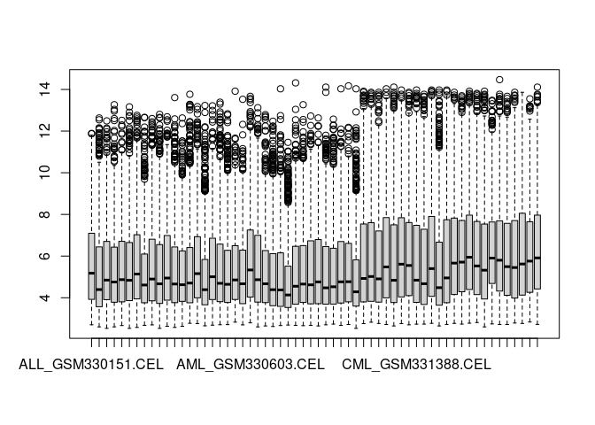<!-- -->

``` r
scaledMat <- scale(mat)
boxplot(scaledMat)
```

<!-- -->

``` r
logMat <- log2(mat)
boxplot(logMat)
```

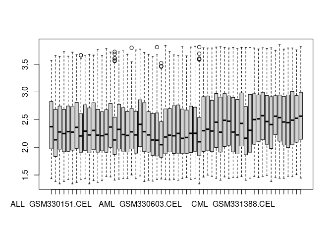<!-- -->

``` r
scaledLogMat <- scale(logMat)
boxplot(scaledLogMat)
```

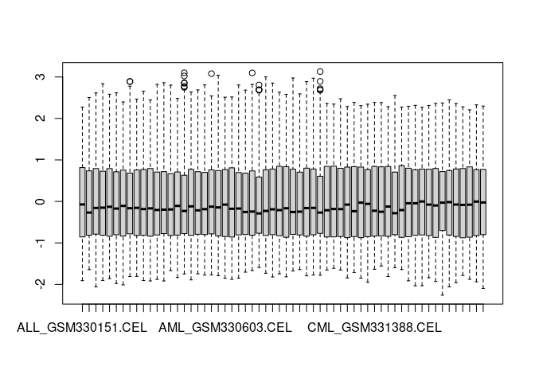<!-- -->

2.  For the same problem above using the unscaled data and different
    data transformation strategies, use the ward.d distance in
    hierarchical clustering and plot multiple heatmaps. You can try to
    use the pheatmap library or any other library that can plot a
    heatmap with a dendrogram. Which data-scaling strategy provides more
    homogeneous clusters with respect to disease types? \[Difficulty:
    Beginner/Intermediate\]

``` r
library(pheatmap)

# set the leukemia type annotation for each sample
annotation_col = data.frame(
                    LeukemiaType =substr(colnames(mat),1,3))
rownames(annotation_col)=colnames(mat)


pheatmap(mat,show_rownames=FALSE,show_colnames=FALSE,
         annotation_col=annotation_col,
         scale = "none",
         clustering_method="ward.D",
         main = "mat without scaling")
```

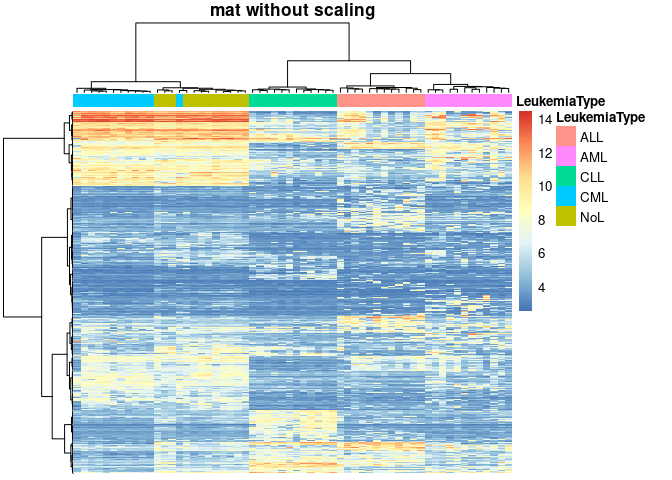<!-- -->

``` r
pheatmap(scaledMat,show_rownames=FALSE,show_colnames=FALSE,
         annotation_col=annotation_col,
         scale = "none",
         clustering_method="ward.D",
        main = "Scaled mat")
```

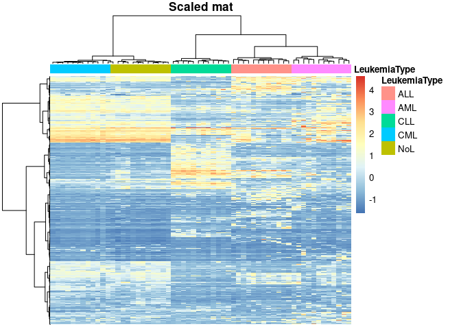<!-- -->

``` r
 pheatmap(scaledLogMat,show_rownames=FALSE,show_colnames=FALSE,
         annotation_col=annotation_col,
         scale = "none",
         clustering_method="ward.D",
         main = "Log2 Scaled mat")
```

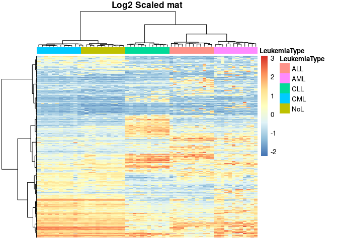<!-- -->

The method argument defines the criteria that directs how the
sub-clusters are merged. During clustering, starting with single-member
clusters, the clusters are merged based on the distance between them.
There are many different ways to define distance between clusters, and
based on which definition you use, the hierarchical clustering results
change. So the method argument controls that. There are a couple of
values this argument can take

``` r
# Heatmap with no clustering_distance
pheatmap(mat,show_rownames=FALSE,show_colnames=FALSE,
         annotation_col=annotation_col,
         scale = "none",
         clustering_method="ward.D2")
```

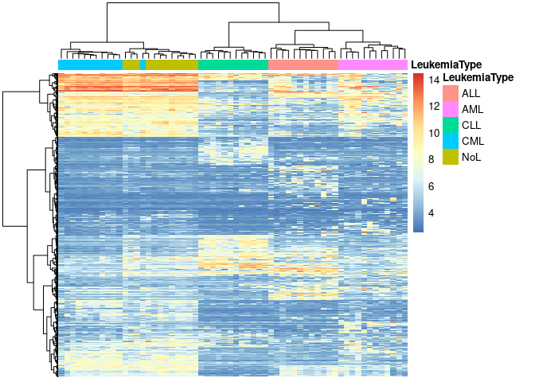<!-- -->

``` r
# Heatmap with  clustering_distance
pheatmap(mat,show_rownames=FALSE,show_colnames=FALSE,
         annotation_col=annotation_col,
         scale = "none",
         clustering_method="ward.D2",
         clustering_distance_rows ="correlation")
```

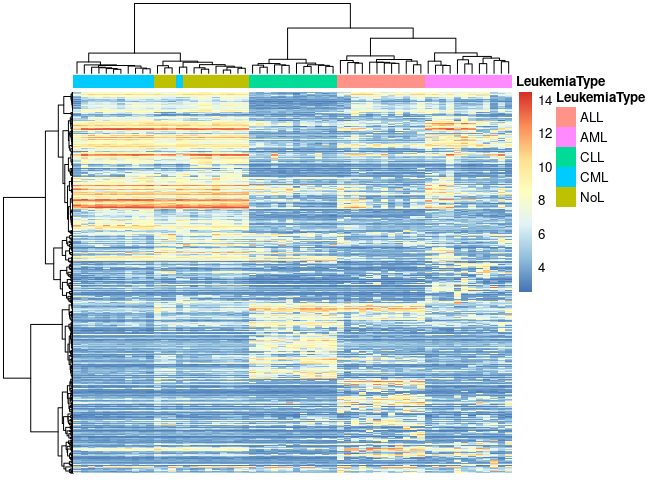<!-- -->

``` r
# There is no correct way to choose the clustering method. You should play with it and see what the best result you get.
```

3.  For the transformed and untransformed data sets used in the exercise
    above, use the silhouette for deciding number of clusters using
    hierarchical clustering. \[Difficulty: Intermediate/Advanced\]

``` r
library(cluster)
set.seed(1996)
Ks=sapply(2:10,
    function(i) 
      summary(silhouette(pam(t(mat),k=i)))$avg.width)
plot(2:10,Ks,xlab="k",ylab="av. silhouette",type="b",
     pch=19)
```

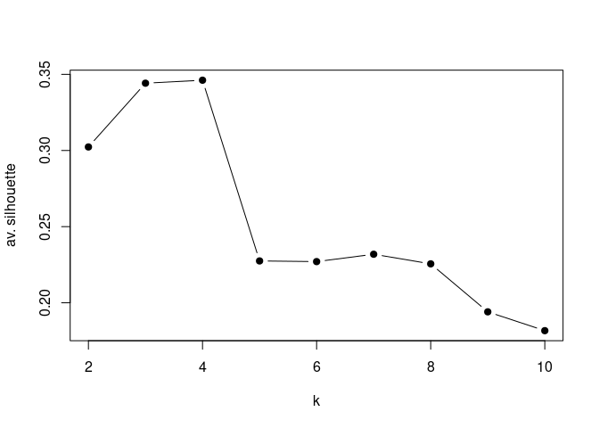<!-- -->

``` r
pamclu=cluster::pam(t(mat),k=4)
plot(silhouette(pamclu),main=NULL)
```

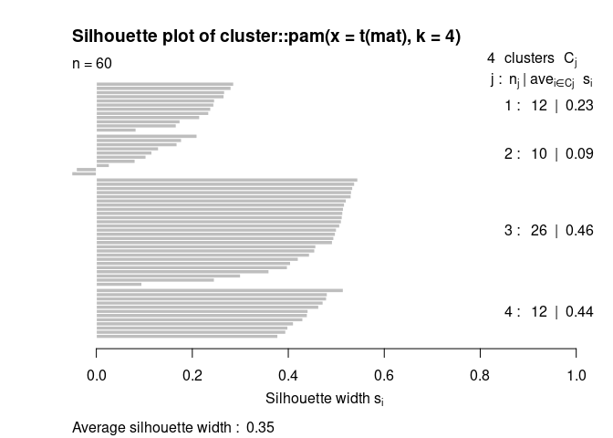<!-- -->

## <span style="color: red;">Answer to question 1:</span>

### It seems that 4 clusters are the best for clustering the data. This is interesting since we have 5 types of samples. However,looking at the heatmaps and principal component analysis, we can see that “CML” and “NoL” samples are very similar, causing them to cluster together.

### Dimension reduction

PCA rotates the original data space such that the axes of the new
coordinate system point to the directions of highest variance of the
data. The axes or new variables are termed principal components (PCs)
and are ordered by variance: The first component, PC 1, represents the
direction of the highest variance of the data. The direction of the
second component, PC 2, represents the highest of the remaining variance
orthogonal to the first component. This can be naturally extended to
obtain the required number of components, which together span a
component space covering the desired amount of variance. In our toy
example with only two genes, the principal components are drawn over the
original scatter plot and in the next plot we show the new coordinate
system based on the principal components. We will calculate the PCA with
the princomp() function; this function returns the new coordinates as
well. These new coordinates are simply a projection of data over the new
coordinates.

``` r
par(mfrow=c(1,2))

# create the subset of the data with two genes only
# notice that we transpose the matrix so samples are 
# on the columns
sub.mat=t(mat[rownames(mat) %in% c("ENSG00000100504","ENSG00000105383"),])

# ploting our genes of interest as scatter plots
plot(scale(mat[rownames(mat)=="ENSG00000100504",]),
     scale(mat[rownames(mat)=="ENSG00000105383",]),
     pch=19,
     ylab="CD33 (ENSG00000105383)",
     xlab="PYGL (ENSG00000100504)",
     col=as.factor(annotation_col$LeukemiaType),
     xlim=c(-2,2),ylim=c(-2,2))

# create the legend for the Leukemia types
legend("bottomright",
       legend=unique(annotation_col$LeukemiaType),
       fill =palette("default"),
       border=NA,box.col=NA)

# calculate the PCA only for our genes and all the samples
pr=princomp(scale(sub.mat))


# plot the direction of eigenvectors
# pr$loadings returned by princomp has the eigenvectors
arrows(x0=0, y0=0, x1 = pr$loadings[1,1], 
         y1 = pr$loadings[2,1],col="pink",lwd=3)
arrows(x0=0, y0=0, x1 = pr$loadings[1,2], 
         y1 = pr$loadings[2,2],col="gray",lwd=3)


# plot the samples in the new coordinate system
plot(-pr$scores,pch=19,
     col=as.factor(annotation_col$LeukemiaType),
     ylim=c(-2,2),xlim=c(-4,4))

# plot the new coordinate basis vectors
arrows(x0=0, y0=0, x1 =-2, 
         y1 = 0,col="pink",lwd=3)
arrows(x0=0, y0=0, x1 = 0, 
         y1 = -1,col="gray",lwd=3)
```

<!-- -->

``` r
# The arrows represent eigenvectors showing the direction of greatest variation.
```

1.  Do PCA on the expression matrix using the princomp() function and
    then use the screeplot() function to visualize the explained
    variation by eigenvectors. How many top components explain 95% of
    the variation? \[Difficulty:Beginner\]

``` r
pr=princomp(scale(mat))
screeplot(pr)
```

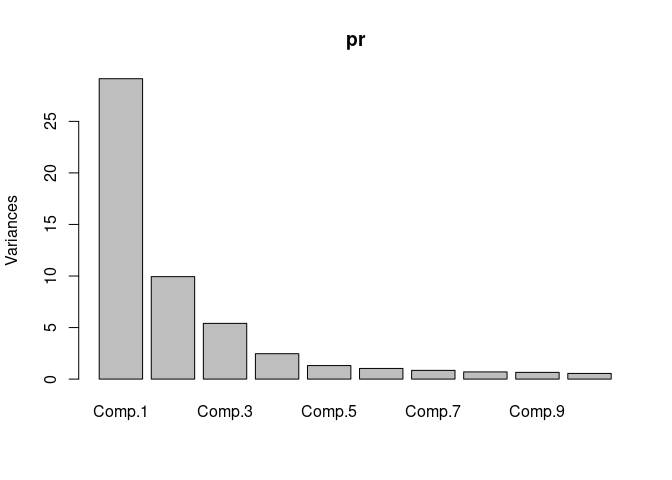<!-- -->

There are 3 principal components that explain 95% of the difference

``` r
#PCA
library(stats)
library(ggplot2) 
# install.packages("ggfortify") ggfortify is needed to let ggplot2 know about PCA data structure.
library(ggfortify)

#compute PCA
pcaResults <- prcomp(t(logMat))
autoplot(pcaResults, data = annotation_col, colour = 'LeukemiaType')
```

<!-- -->

2.  In this exercise we use the Rtsne() function on the leukemia
    expression data set. Try to increase and decrease perplexity t-sne,
    and describe the observed changes in 2D plots. \[Difficulty:
    Beginner\]

``` r
library("Rtsne")
set.seed(1996) 
tsne_out <- Rtsne(t(mat),perplexity = 10) 
plot(tsne_out$Y,col=as.factor(annotation_col$LeukemiaType),
     pch=19,main="perplexity = 10")

legend("bottomright",
       legend=unique(annotation_col$LeukemiaType),
       fill =palette("default"),
       border=NA,box.col=NA)
```

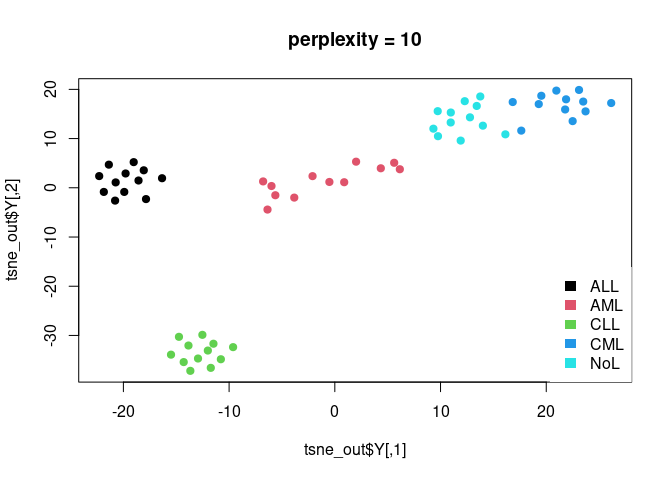<!-- -->

``` r
tsne_out <- Rtsne(t(mat),perplexity = 2) 
plot(tsne_out$Y,col=as.factor(annotation_col$LeukemiaType),
     pch=19,main="perplexity = 2")

legend("bottomright",
       legend=unique(annotation_col$LeukemiaType),
       fill =palette("default"),
       border=NA,box.col=NA)
```

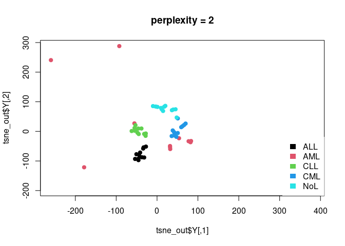<!-- -->

``` r
tsne_out <- Rtsne(t(mat),perplexity = 15) 
plot(tsne_out$Y,col=as.factor(annotation_col$LeukemiaType),
     pch=19,main="perplexity = 15")

legend("bottomright",
       legend=unique(annotation_col$LeukemiaType),
       fill =palette("default"),
       border=NA,box.col=NA)
```

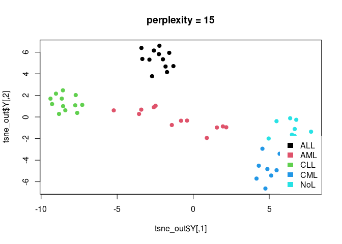<!-- -->

``` r
tsne_out <- Rtsne(t(mat),perplexity = 5) 
plot(tsne_out$Y,col=as.factor(annotation_col$LeukemiaType),
     pch=19,main="perplexity = 5")

legend("bottomright",
       legend=unique(annotation_col$LeukemiaType),
       fill =palette("default"),
       border=NA,box.col=NA)
```

<!-- -->

``` r
tsne_out <- Rtsne(t(mat),perplexity = 18) 
plot(tsne_out$Y,col=as.factor(annotation_col$LeukemiaType),
     pch=19,main="perplexity = 18")

legend("bottomright",
       legend=unique(annotation_col$LeukemiaType),
       fill =palette("default"),
       border=NA,box.col=NA)
```

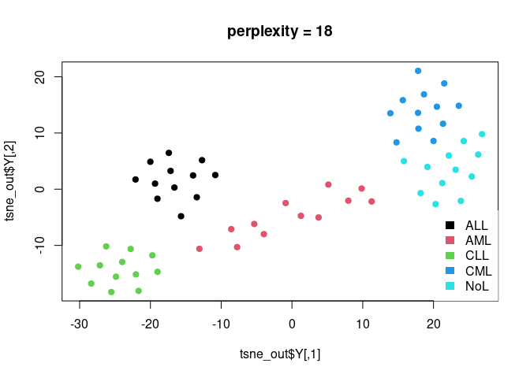<!-- -->

### The more the perplexity is increased, the more separation we get (however we can get unwanted separation if it is increased too much)

[link to github
repository](https://github.com/ferasmachour/Genomic_Data_Science_Course.git)
