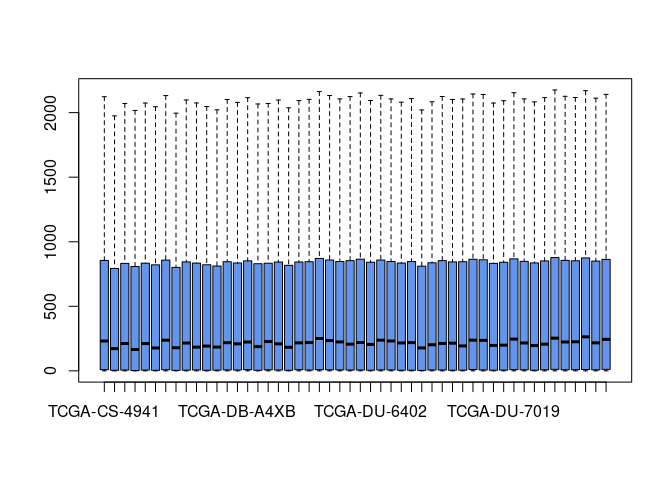
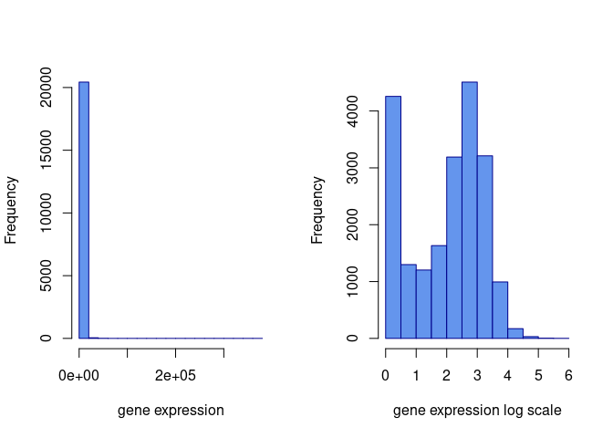
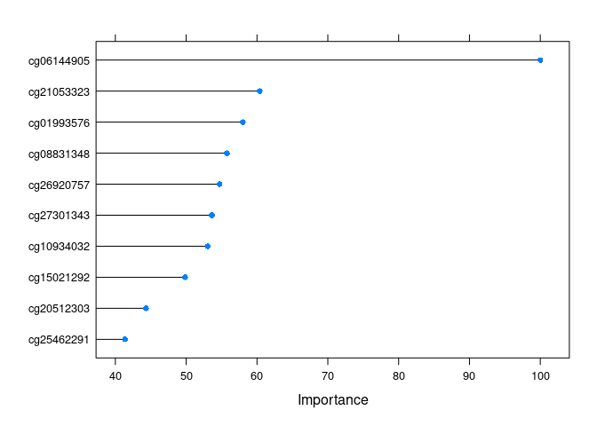

Tutorial_7
================
Feras Machour
12/23/2021

[GitHub](https://github.com/ferasmachour/Genomic_Data_Science_Course.git)

### Classification

For this set of exercises we will be using the gene expression and
patient annotation data from the glioblastoma patient.The glioblastoma
tumor samples are from The Cancer Genome Atlas project. We will try to
predict the subtype of this disease using molecular markers. This
subtype is characterized by large-scale epigenetic alterations called
the “CpG island methylator phenotype” or “CIMP”

``` r
library(compGenomRData)
# get file paths
fileLGGexp=system.file("extdata",
                      "LGGrnaseq.rds",
                      package="compGenomRData")
fileLGGann=system.file("extdata",
                      "patient2LGGsubtypes.rds",
                      package="compGenomRData")
# gene expression values
gexp=readRDS(fileLGGexp)

# patient annotation
patient=readRDS(fileLGGann)

head(gexp[,1:5])
```

    ##       TCGA-CS-4941 TCGA-CS-4944 TCGA-CS-5393 TCGA-CS-5394 TCGA-CS-5395
    ## A1BG       72.2326      24.7132      46.3789      37.9659      19.5162
    ## A1CF        0.0000       0.0000       0.0000       0.0000       0.0000
    ## A2BP1     524.4997     105.4092     323.5828      19.7390     299.5375
    ## A2LD1     144.0856      18.0154      29.0942       7.5945     202.1231
    ## A2ML1     521.3941     159.3746     164.6157      63.5664     953.4106
    ## A2M     17944.7205   10894.9590   16480.1130    9217.7919   10801.8461

``` r
dim(gexp)
```

    ## [1] 20501   184

``` r
head(patient)
```

    ##              subtype
    ## TCGA-FG-8185    CIMP
    ## TCGA-DB-5276    CIMP
    ## TCGA-P5-A77X    CIMP
    ## TCGA-IK-8125    CIMP
    ## TCGA-DU-A5TR    CIMP
    ## TCGA-E1-5311    CIMP

``` r
dim(patient)
```

    ## [1] 184   1

1.  Our first task is to not use any data transformation and do
    classification. Run the k-NN classifier on the data without any
    transformation or scaling. What is the effect on classification
    accuracy for k-NN predicting the CIMP and noCIMP status of the
    patient?

Here we will preprocess the data before we start training. This might
include exploratory data analysis to see how variables and samples
relate to each other. For example, we might want to check the
correlation between predictor variables and keep only one variable from
that group. In addition, some training algorithms might be sensitive to
data scales or outliers. We should deal with those issues in this step.
In some cases, the data might have missing values. We can choose to
remove the samples that have missing values or try to impute them. Many
machine learning algorithms will not be able to deal with missing
values.

``` r
library(caret)
```

    ## Loading required package: ggplot2

    ## Loading required package: lattice

``` r
# With transformation and scaling

# The first thing we will do is data normalization and transformation. We have to take care of data scale issues that might come from how the experiments are performed and the potential problems that might occur during data collection. Ideally, each tumor sample has a similar distribution of gene expression values. Systematic differences between tumor samples must be corrected. We check if there are such differences using box plots. We will only plot the first 50 tumor samples so that the figure is not too squished

boxplot(gexp[,1:50],outline=FALSE,col="cornflowerblue")
```

<!-- -->

``` r
#It seems there was some normalization done on this data. Gene expression values per sample seem to have the same scale. However, it looks like they have long-tailed distributions, so a log transformation may fix that. These long-tailed distributions have outliers and this might adversely affect the models. Below, we show the effect of log transformation on the gene expression profile of a patient. We add a pseudo count of 1 to avoid log(0)

par(mfrow=c(1,2))
hist(gexp[,5],xlab="gene expression",main="",border="blue4",
     col="cornflowerblue")
hist(log10(gexp+1)[,5], xlab="gene expression log scale",main="",
     border="blue4",col="cornflowerblue")
```

<!-- -->

``` r
#Since taking a log seems to work to tame the extreme values, we do that below and also add 1 pseudo-count to be able to deal with 0 values:
gexp=log10(gexp+1)

# transpose the data set
tgexp <- t(gexp)

# filter predictor variables which have low variation
#The more variables, the slower the algorithms will be generally.

# remove near zero variation for the columns at least
# 85% of the values are the same
# this function creates the filter but doesn't apply it yet
nzv=preProcess(tgexp,method="nzv",uniqueCut = 15)

# apply the filter using "predict" function
# return the filtered dataset and assign it to nzv_tgexp
# variable
nzv_tgexp=predict(nzv,tgexp)

dim(tgexp)
```

    ## [1]   184 20501

``` r
dim(nzv_tgexp)
```

    ## [1]   184 18881

``` r
tgexp <- nzv_tgexp

# In addition, we can also choose arbitrary cutoffs for variability. For example, we can choose to take the top 1000 variable predictors.
SDs=apply(tgexp,2,sd )
topPreds=order(SDs,decreasing = TRUE)[1:1000]
tgexp=tgexp[,topPreds]

# We can scale the data. When we scale, each value of the predictor variable is divided by its standard deviation. Therefore predictor variables will have the same standard deviation. These manipulations are generally used to improve the numerical stability of some calculations. In distance-based metrics, it could be beneficial to at least center the data. We will now center the data using the preProcess() function. This is more practical than the scale() function because when we get a new data point, we can use the predict() function and processCenter object to process it just like we did for the training samples.

processCenter=preProcess(tgexp, method = c("center"))
tgexp=predict(processCenter,tgexp)

# create a filter for removing higly correlated variables
# if two variables are highly correlated only one of them
# is removed
corrFilt=preProcess(tgexp, method = "corr",cutoff = 0.9)
tgexp=predict(corrFilt,tgexp)

# For demonstration purposes, we will now introduce NA values in our data, the “NA” value is normally used to encode missing values in R. We then show how to check and deal with those. One way is to impute them; here, we again use a machine learning algorithm to guess the missing values. Another option is to discard the samples with missing values or discard the predictor variables with missing values. First, we replace one of the values as NA and check if it is there.

missing_tgexp=tgexp
missing_tgexp[1,1]=NA
anyNA(missing_tgexp) # check if there are NA values
```

    ## [1] TRUE

``` r
gexpnoNA=missing_tgexp[ , colSums(is.na(missing_tgexp)) == 0]


# We will next try to impute the missing value(s). Imputation can be as simple as assigning missing values to the mean or median value of the variable, or assigning the mean/median of values from nearest neighbors of the sample having the missing value. We will show both using the caret::preProcess() function. First, let us run the median imputation.

mImpute=preProcess(missing_tgexp,method="medianImpute")
imputedGexp=predict(mImpute,missing_tgexp)

# Splitting the data - into the test and the training partitions. The reason for this is that we need an independent test we did not train on. 

tgexp=merge(patient,tgexp,by="row.names")

# push sample ids back to the row names
rownames(tgexp)=tgexp[,1]
tgexp=tgexp[,-1]

# There are multiple data split strategies. For starters, we will split 30% of the data as the test. This method is the gold standard for testing performance of our model.

set.seed(1996)
intrain <- createDataPartition(y = tgexp[,1], p= 0.7)[[1]]

# seperate test and training sets
training <- tgexp[intrain,]
testing <- tgexp[-intrain,]

knnFit=knn3(x=training[,-1], # training set
            y=training[,1], # training set class labels
            k=5)
# predictions on the test set
trainPred=predict(knnFit,testing[,-1])

# predictions on the training set
trainPred=predict(knnFit,training[,-1],type="class")

# compare the predicted labels to real labels
# get different performance metrics
confusionMatrix(data=training[,1],reference=trainPred)
```

    ## Confusion Matrix and Statistics
    ## 
    ##           Reference
    ## Prediction CIMP noCIMP
    ##     CIMP     64      1
    ##     noCIMP    2     63
    ##                                          
    ##                Accuracy : 0.9769         
    ##                  95% CI : (0.934, 0.9952)
    ##     No Information Rate : 0.5077         
    ##     P-Value [Acc > NIR] : <2e-16         
    ##                                          
    ##                   Kappa : 0.9538         
    ##                                          
    ##  Mcnemar's Test P-Value : 1              
    ##                                          
    ##             Sensitivity : 0.9697         
    ##             Specificity : 0.9844         
    ##          Pos Pred Value : 0.9846         
    ##          Neg Pred Value : 0.9692         
    ##              Prevalence : 0.5077         
    ##          Detection Rate : 0.4923         
    ##    Detection Prevalence : 0.5000         
    ##       Balanced Accuracy : 0.9770         
    ##                                          
    ##        'Positive' Class : CIMP           
    ## 

``` r
# predictions on the test set, return class labels
testPred=predict(knnFit,testing[,-1],type="class")

# compare the predicted labels to real labels
# get different performance metrics
confusionMatrix(data=testing[,1],reference=testPred)
```

    ## Confusion Matrix and Statistics
    ## 
    ##           Reference
    ## Prediction CIMP noCIMP
    ##     CIMP     25      2
    ##     noCIMP    2     25
    ##                                           
    ##                Accuracy : 0.9259          
    ##                  95% CI : (0.8211, 0.9794)
    ##     No Information Rate : 0.5             
    ##     P-Value [Acc > NIR] : 1.901e-11       
    ##                                           
    ##                   Kappa : 0.8519          
    ##                                           
    ##  Mcnemar's Test P-Value : 1               
    ##                                           
    ##             Sensitivity : 0.9259          
    ##             Specificity : 0.9259          
    ##          Pos Pred Value : 0.9259          
    ##          Neg Pred Value : 0.9259          
    ##              Prevalence : 0.5000          
    ##          Detection Rate : 0.4630          
    ##    Detection Prevalence : 0.5000          
    ##       Balanced Accuracy : 0.9259          
    ##                                           
    ##        'Positive' Class : CIMP            
    ## 

## <span style="color: red;">Answer to question 1:</span>

### Without any transformation or scaling

``` r
tgexp_noscale <- t(gexp)

tgexp_noscale=merge(patient,tgexp_noscale,by="row.names")
rownames(tgexp_noscale)=tgexp_noscale[,1]
tgexp_noscale=tgexp_noscale[,-1]


set.seed(1996)
intrain <- createDataPartition(y = tgexp_noscale[,1], p= 0.7)[[1]]

# seperate test and training sets
training <- tgexp_noscale[intrain,]
testing <- tgexp_noscale[-intrain,]

knnFit=knn3(x=training[,-1], # training set
            y=training[,1], # training set class labels
            k=5)
# predictions on the test set
trainPred=predict(knnFit,testing[,-1])

# predictions on the training set
trainPred=predict(knnFit,training[,-1],type="class")

# compare the predicted labels to real labels
# get different performance metrics
confusionMatrix(data=training[,1],reference=trainPred)
```

    ## Confusion Matrix and Statistics
    ## 
    ##           Reference
    ## Prediction CIMP noCIMP
    ##     CIMP     64      1
    ##     noCIMP    3     62
    ##                                           
    ##                Accuracy : 0.9692          
    ##                  95% CI : (0.9231, 0.9916)
    ##     No Information Rate : 0.5154          
    ##     P-Value [Acc > NIR] : <2e-16          
    ##                                           
    ##                   Kappa : 0.9385          
    ##                                           
    ##  Mcnemar's Test P-Value : 0.6171          
    ##                                           
    ##             Sensitivity : 0.9552          
    ##             Specificity : 0.9841          
    ##          Pos Pred Value : 0.9846          
    ##          Neg Pred Value : 0.9538          
    ##              Prevalence : 0.5154          
    ##          Detection Rate : 0.4923          
    ##    Detection Prevalence : 0.5000          
    ##       Balanced Accuracy : 0.9697          
    ##                                           
    ##        'Positive' Class : CIMP            
    ## 

``` r
# predictions on the test set, return class labels
testPred=predict(knnFit,testing[,-1],type="class")

# compare the predicted labels to real labels
# get different performance metrics
confusionMatrix(data=testing[,1],reference=testPred)
```

    ## Confusion Matrix and Statistics
    ## 
    ##           Reference
    ## Prediction CIMP noCIMP
    ##     CIMP     25      2
    ##     noCIMP    4     23
    ##                                           
    ##                Accuracy : 0.8889          
    ##                  95% CI : (0.7737, 0.9581)
    ##     No Information Rate : 0.537           
    ##     P-Value [Acc > NIR] : 3.236e-08       
    ##                                           
    ##                   Kappa : 0.7778          
    ##                                           
    ##  Mcnemar's Test P-Value : 0.6831          
    ##                                           
    ##             Sensitivity : 0.8621          
    ##             Specificity : 0.9200          
    ##          Pos Pred Value : 0.9259          
    ##          Neg Pred Value : 0.8519          
    ##              Prevalence : 0.5370          
    ##          Detection Rate : 0.4630          
    ##    Detection Prevalence : 0.5000          
    ##       Balanced Accuracy : 0.8910          
    ##                                           
    ##        'Positive' Class : CIMP            
    ## 

### Regression

For this set of problems we will use the regression data set where we
tried to predict the age of the sample from the methylation values. The
data can be loaded as shown below:

``` r
# file path for CpG methylation and age
fileMethAge=system.file("extdata",
                      "CpGmeth2Age.rds",
                      package="compGenomRData")

# read methylation-age table
ameth=readRDS(fileMethAge)
```

## <span style="color: red;">Answer to question 2:</span>

2.  Run random forest regression and plot the importance metrics.

``` r
library(matrixStats)
ameth=ameth[,c(TRUE,matrixStats::colSds(as.matrix(ameth[,-1]))>0.1)]
dim(ameth)
```

    ## [1]  108 2290

``` r
set.seed(1996)


trctrl <- trainControl(method = "none")

# we will now train random forest model
rfregFit <- train(Age~., data = ameth, method = "ranger", trControl=trctrl, importance="permutation", tuneGrid = data.frame(mtry=50, min.node.size = 5, splitrule="variance"))
# print OOB error
rfregFit$finalModel$prediction.error
```

    ## [1] 98.31033

``` r
plot(varImp(rfregFit),top=10)
```

<!-- --> [link to
github
repository](https://github.com/ferasmachour/Genomic_Data_Science_Course.git)
